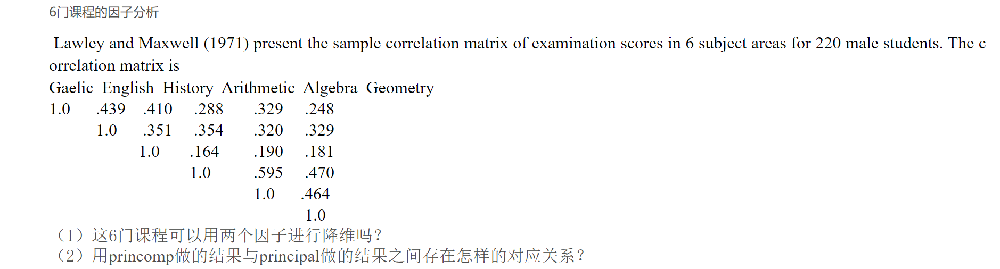
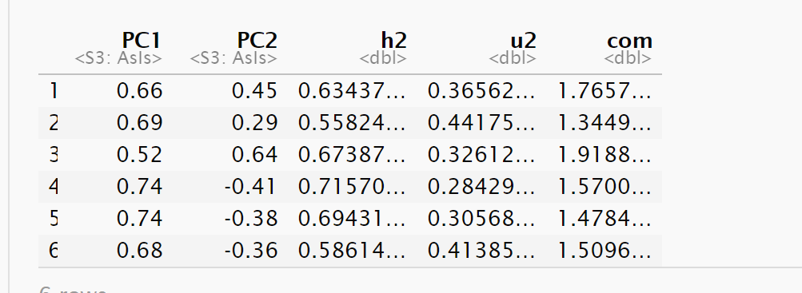

# 讨论题一

-   2025-3-17



## 第一小问

这六门课程可以使用两个因子进行降维，具体解释及求解见下文

1、从理论上来说，这些科可以进行文理分类，具有理论和逻辑基础，应当可以分为两个因子；

2、从数据分析角度，我们使用因子分析法看一看结果如何，如下：

```{R}
# 使用ai输入矩阵
library(stats)
library(psych)
subjects_cor <- matrix(c(
  1.0, 0.439, 0.410, 0.288, 0.329, 0.248,
  0.439, 1.0, 0.351, 0.354, 0.320, 0.329,
  0.410, 0.351, 1.0, 0.164, 0.190, 0.181,
  0.288, 0.354, 0.164, 1.0, 0.595, 0.470,
  0.329, 0.320, 0.190, 0.595, 1.0, 0.464,
  0.248, 0.329, 0.181, 0.470, 0.464, 1.0
), nrow = 6, byrow = TRUE)

subjects_cor
cortest.bartlett(subjects_cor,n=220)


```

```{R}
# 因子分析
fa1 <- factanal(factors = 2, covmat = subjects_cor,rotation="none")
print(fa1)

fa2 <- factanal(factors = 3, covmat = subjects_cor,rotation="varimax")
print(fa2)
```

可解释方差比例有点小啊，不到一半，但是确实可以分为两个因子，就载荷阵来看，三个因子能解释的，两个也能解释。故，我认为第一问可以使用两个因子降维，一个作为综合，一个作为对比。

## 第二小问

#### **用princomp做的结果与principal做的结果之间存在怎样的对应关系？**

首先什么是**princomp与principal?\
在R语言中：**

<https://zhuanlan.zhihu.com/p/496823203>R语言 \| 主成分分析：princomp vs. prcomp vs. principal - 知乎 (zhihu.com)

```{R}
#  princomp
princomp_1 <- princomp(covmat=subjects_cor, cor = T)
# 注意这个参数的用法
summary(princomp_1,loadings=T)

```

```{R}
# principal
principal_1 <- principal(subjects_cor,nfactors=2,rotate="none")
principal_1
print("-----------------------------------------------------------")
principal_2 <- principal(subjects_cor,nfactors=2,rotate="varimax")
principal_2
```

就上述代码结果而言，好像看不出什么关系,该关系是不是需要先从理论层面推导，再以代码验证？

借鉴一下：\
princomp()函数得出来的结果（Comp.1...），与我们求解[相关系数矩阵](https://zhida.zhihu.com/search?content_id=92540452&content_type=Answer&match_order=1&q=%E7%9B%B8%E5%85%B3%E7%B3%BB%E6%95%B0%E7%9F%A9%E9%98%B5&zhida_source=entity)得出的特征向量和特征值是一致的，这个特征向量代表的是主成分（PC1...）与各变量(X1...)的回归系数；而principal()函数得出的结果，是主成分(PC1...）与各变量(X1...)的相关系数，所以不一样，因为中间有一个变换：相关系数的求解公式如下：corr(PC1,X1)=a11\*\[Var(PC1)\]\^(0.5) ,其中Var(PC1)就是主成分PC1的特征值。也就是说：principal()函数得出的结果，可以用来更好的解释主成分与原变量之间的相关性。\
作者：liar lee\
链接：https://www.zhihu.com/question/52027293/answer/343635079\

$$
Cor(PC1,X1
)=a11*[Var(PC1)]^{0.5}$$

这个公式见过，学综合评价的时候似乎用过它，或者是类似的，这应当就是他们之间的关系了。

```{R}
# 求其特征值与特征向量
eigen(subjects_cor)
0.3979211*sqrt(2.7328841)
```

## 总结

(1)、

这六门课程可以使用两个因子进行降维，具体解释及求解见下文

1、从理论上来说，这些科可以进行文理分类，具有理论和逻辑基础，应当可以分为两个因子；

2、从数据分析角度，我们使用因子分析法看一下结果如何

```{R}
fa2 <- factanal(factors = 2, covmat = subjects_cor,rotation="varimax")
print(fa2)
```

（2）、

$$
Fa\_(PC11)=comp_{11}*[PC\_PC1)]^{0.5}\\
$$

$$
Corr(PC1,X1)=a11*[Var(PC1)]^{0.5}\\
$$

$$
0.6578208=0.3979211*sqrt(2.7328841)\\
$$

该公式似乎便是相关关系具体解释如下:

```{R}
princomp_1 <- princomp(covmat=subjects_cor, cor = T)
# 注意这个参数的用法
summary(princomp_1,loadings=T)

```

```{R}
principal_1 <- principal(subjects_cor,nfactors=2,rotate="none")
principal_1
```



```{R}
# 求其特征值与特征向量
eigen(subjects_cor)
0.3979211*sqrt(2.7328841)

```

参考：链接：https://www.zhihu.com/question/52027293/answer/343635079
