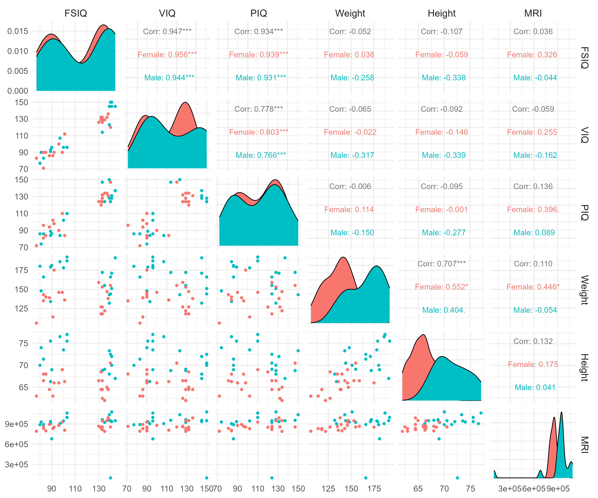
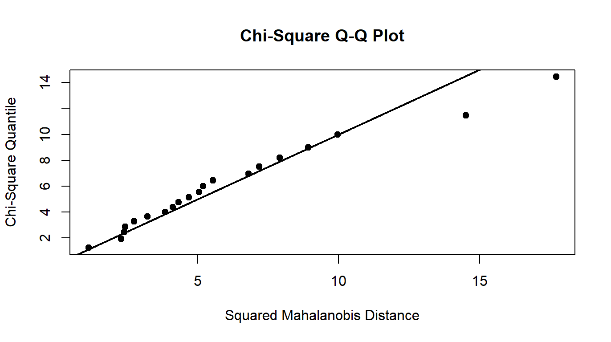
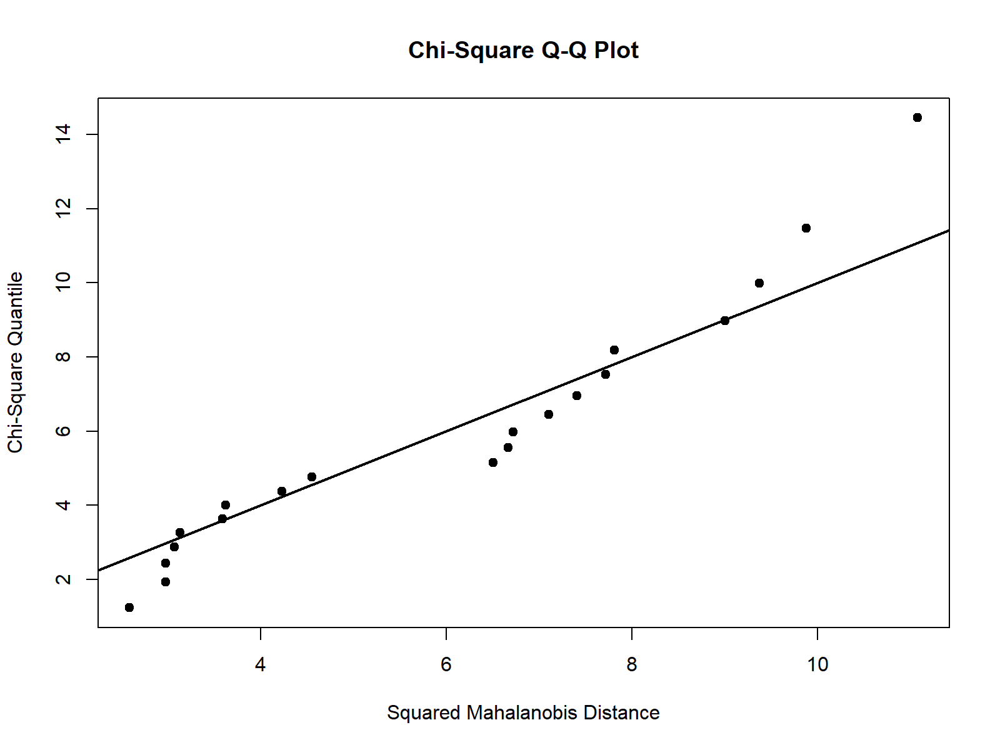
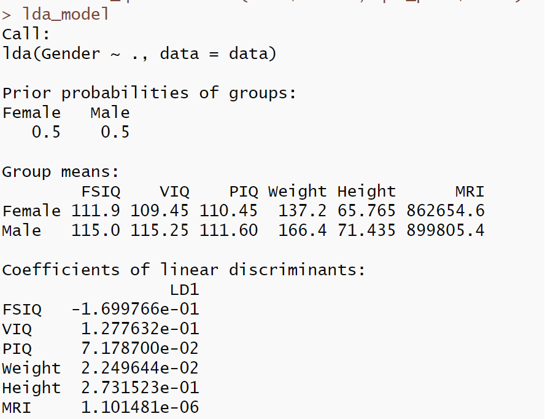
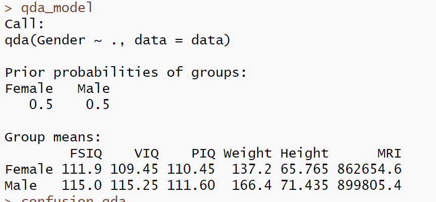

# 实验考试题
**多元统计分析实验试题（15）**

在一项研究中，我们感兴趣的是能否构建一种判别函数，利用大脑尺寸数据和其他变量来区分男性和女性。研究者收集了20名男性和20名女性的数据。受试者参加了韦氏成人智力量表修订版的四个子测验。测验记录的分数为全量表智商（FSIQ）、言语智商（VIQ）和操作智商（PIQ）。研究者还记录了受试者的身高（Height）、体重（Weight）、19次磁共振成像（MRI）扫描记录扫描的总像素计数。具体数据如下：

Gender FSIQ VIQ PIQ Weight Height MRI

Male 140 150 124 166 72.5 100121

Male 139 123 150 143 73.3 1038437

Male 133 129 128 172 68.8 965353

Male 89 93 84 134 66.3 904858

Male 133 114 147 172 68.8 955466

Male 141 150 128 151 70.0 1079549

Male 135 129 124 155 69.1 924059

Male 100 96 102 178 73.5 945088

Male 80 77 86 180 70.0 889083

Male 83 83 86 166 71.4 892420

Male 97 107 84 186 76.5 905940

Male 139 145 128 132 68.0 955003

Male 141 145 131 171 72.0 935494

Male 103 96 110 187 77.0 1062462

Male 144 145 137 191 67.0 949589

Male 103 96 110 192 75.5 997925

Male 90 96 86 181 69.0 679987

Male 140 150 124 144 70.5 949395

Male 81 90 74 148 74.0 930016

Male 89 91 89 179 75.5 935863

Female 133 132 124 118 64.5 816932

Female 137 132 134 147 65.0 951545

Female 99 90 110 146 69.0 928799

Female 138 136 131 138 64.5 991305

Female 92 90 98 175 66.0 854258

Female 132 129 124 118 64.5 833868

Female 140 120 147 155 70.5 856472

Female 96 100 90 146 66.0 878897

Female 83 71 96 135 68.0 865363

Female 132 132 120 127 68.5 852244

Female 101 112 84 136 66.3 808020

Female 135 129 134 122 62.0 790619

Female 91 86 102 114 63.0 831772

Female 85 90 84 140 68.0 798612

Female 77 83 72 106 63.0 793549

Female 130 126 124 159 66.5 866662

Female 133 126 132 127 62.5 857782

Female 83 90 81 143 66.5 834344

Female 133 129 128 153 66.5 948066

Female 88 86 94 139 64.5 893983


## 实验要求：

（1）对上表中的数据作多联二维散点图，不同的类用不同的颜色或记号标识；

（2）检验两类数据是否服从正态分布；

（3）检验男性和女性的指标之间是否存在显著差异；

（4）建立判别函数，并对结果进行解释。

（5）若有两名新的受试者A和B，其中A的各项指标分别为142，147，126，146，72.5，939395，B的各项指标分别为130，91，116，133，70.4，841395，请问他们是男性还是女性。

**请给出详细的实验分析报告。**

## 实验报告：
### 1
1.  对上表中的数据作多联二维散点图，不同的类用不同的颜色或记号标识；

代码如下：
```{R}
#加载必要的包
library(readxl)
library(ggplot2)
library(MASS)
library(car)
library(mvnormtest)
library(GGally)
library(MVN)

#读取数据
data <- read_excel("数据.xlsx")

#1. 多联二维散点图
pairs(data[,-1])
pairs_plot <- ggpairs(data, 
                      columns = c("FSIQ", "VIQ", "PIQ", "Weight", "Height", "MRI"),
                      mapping = aes(color = Gender),
                      upper = list(continuous = wrap("cor", size = 4)),
                      lower = list(continuous = wrap("points", size = 1.5))
) +
  theme_minimal(base_size = 14) + 
  theme(
    strip.text = element_text(size = 14),     # 对角线变量标签
    axis.text = element_text(size = 12),      # 坐标轴刻度
  )

print(pairs_plot)
ggsave("pairs_plot.png", pairs_plot, width = 12, height = 10)
```

图 1 多联二维散点图

就密度函数而言，女性的密度函数大多比男性高；我们从相关性上判断，VIQ与PIQ,VIQ与FSIQ，PIQ与FSIQ，Weight与Height之间的的相关度较高；而且我们从图中判断，数据大概率不服从正态分布；

### 2
（2）检验两类数据是否服从正态分布；

在这一部分我们分别进行总体性检验与指标检验，检验结果如下：

#### 1.分男女检验：

男性正态性检验：
```{R}
male_data <- subset(data, Gender == "Male")
female_data <- subset(data, Gender == "Female")
result <- mvn(data = male_data[,-1], mvnTest = "hz", 
              multivariatePlot = "qq")
print(result$multivariateNormality)
```

图 2 男性正态性检验QQ图

表 1 男性正态性检验表

| Test          | HZ       | p value       | MVN |
|---------------|----------|----------------|-----|
| Henze-Zirkler | 1.067786 | 0.0002786515   | NO  |

拒绝原假设，即不服从正态分布

女性正态性检验：

```{R}
result <- mvn(data = female_data[,-1], mvnTest = "hz", 
              multivariatePlot = "qq")
print(result$multivariateNormality)
```

图 3 女性正态性检验图

表 2 女性正态性检验表

| Test          | HZ        | p value     | MVN |
|---------------|-----------|-------------|-----|
| Henze-Zirkler | 0.9282983 | 0.06400542  | YES |

显然，在95%的置信水平下，可以认为女性数据此时服从正态分布。

#### 2.分男女也分指标

进行Shapiro-Wilk检验，直接调用之前实验的函数
```{R}
variables <- c("FSIQ", "VIQ", "PIQ", "Weight", "Height", "MRI")
normality_tests <- data.frame(
  Variable = character(),
  Gender = character(),
  p_value = numeric(),
  stringsAsFactors = FALSE
)
for(i in variables) {
  male_test <- shapiro.test(male_data[[i]])
  female_test <- shapiro.test(female_data[[i]])
  normality_tests <- rbind(normality_tests,
    data.frame(Variable = i, Gender = "Male", p_value = male_test$p.value),
    data.frame(Variable = i, Gender = "Female", p_value = female_test$p.value)
  )
}
normality_tests

```

表 3 分指标正态性检验

| Variable | Gender | p_value       |
|----------|--------|---------------|
| FSIQ     | Male   | 1.766304e-03  |
| FSIQ     | Female | 1.717051e-03  |
| VIQ      | Male   | 1.911990e-02  |
| VIQ      | Female | 6.750632e-03  |
| PIQ      | Male   | 8.110641e-02  |
| PIQ      | Female | 2.030746e-01  |
| Weight   | Male   | 1.579486e-01  |
| Weight   | Female | 9.786421e-01  |
| Height   | Male   | 4.983862e-01  |
| Height   | Female | 7.425947e-01  |
| MRI      | Male   | 1.200339e-06  |
| MRI      | Female | 1.225714e-01  |


无论男女，PIQ,Height,Weight正态性都可以接受，MRI的女性为正态，其余没有通过正态检验。

### 3
（3）检验男性和女性的指标之间是否存在显著差异；
```{R}
male_matrix <- as.matrix(male_data[, variables])
female_matrix <- as.matrix(female_data[, variables])
hotelling_test <- hotelling.test(male_matrix, female_matrix)
```

| Test stat | Numerator df | Denominator df | P-value     |
|-----------|---------------|----------------|-------------|
| 64.681    | 6             | 33             | 5.172e-06   |

P 值小于0.5，拒绝原假设，即男女在这6个变量的均值组合上存在显著差异

### 4
（4）建立判别函数，并对结果进行解释。
```{R}
X <- data[, variables]
y <- data$Gender
#进行判别分析
lda_model <- lda(Gender ~ ., data = data)
lda_pred <- predict(lda_model, data)
confusion_lda <- table(data$Gender, lda_pred$class)
#qda
qda_model <- qda(Gender ~ ., data = data)
qda_pred <- predict(qda_model, data)
confusion_qda <- table(data$Gender, qda_pred$class)
```

表 5 lda混淆矩阵

|           | Female | Male |
|-----------|--------|------|
| **Female**| 20     | 0    |
| **Male**  | 2      | 18   |



表 6 qda混淆矩阵

|           | Female | Male |
|-----------|--------|------|
| **Female**| 20     | 0    |
| **Male**  | 4      | 16   |

Qda比lda错分了两个男性，所以在判别精度上看，男性lda要高于qda。

在变量的贡献度上来看：身高（Height）最有判别力；其次是 FSIQ、VIQ、MRI 。我们的判别函数主要依赖于这些变量。

### 5
（5）若有两名新的受试者A和B，其中A的各项指标分别为142，147，126，146，72.5，939395，B的各项指标分别为130，91，116，133，70.4，841395，请问他们是男性还是女性。

```{R}
new_samples <- data.frame(
  FSIQ = c(142, 130),
  VIQ = c(147, 91),
  PIQ = c(126, 116),
  Weight = c(146, 133),
  Height = c(72.5, 70.4),
  MRI = c(939395, 841395)
)

new_predictions <- predict(lda_model, new_samples)
new_predictions <- predict(qda_model, new_samples)
cat("\n=== 新样本预测结果 ===\n")
print(newPreLda$class) 
cat("\n=== 新样本预测结果 ===\n")
print(newPreQda$class)
```
即lda判别函数将A判为男性，B为女性；
Qda判别函数认为A，B都是男性。
鉴于4中的分析，我们采用lda判别结果。


