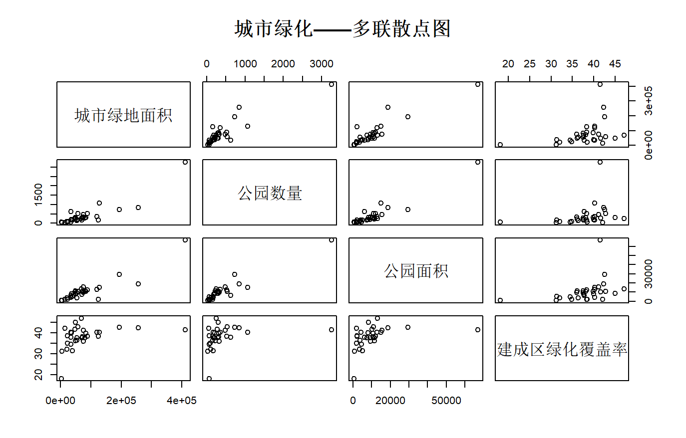
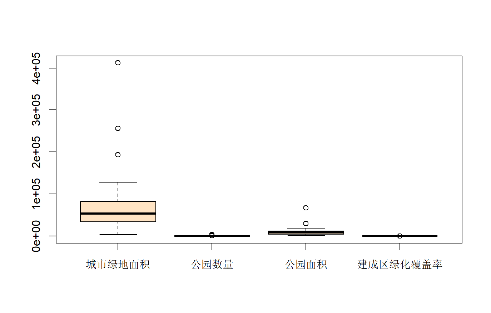
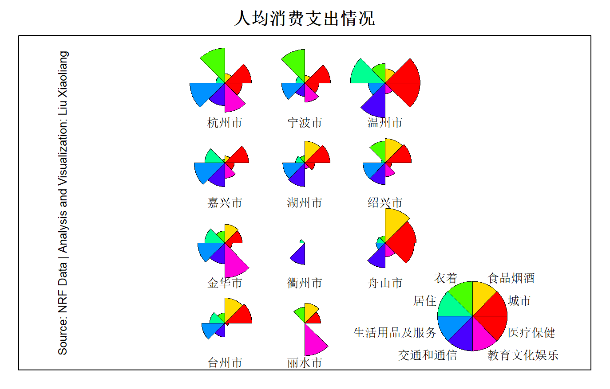
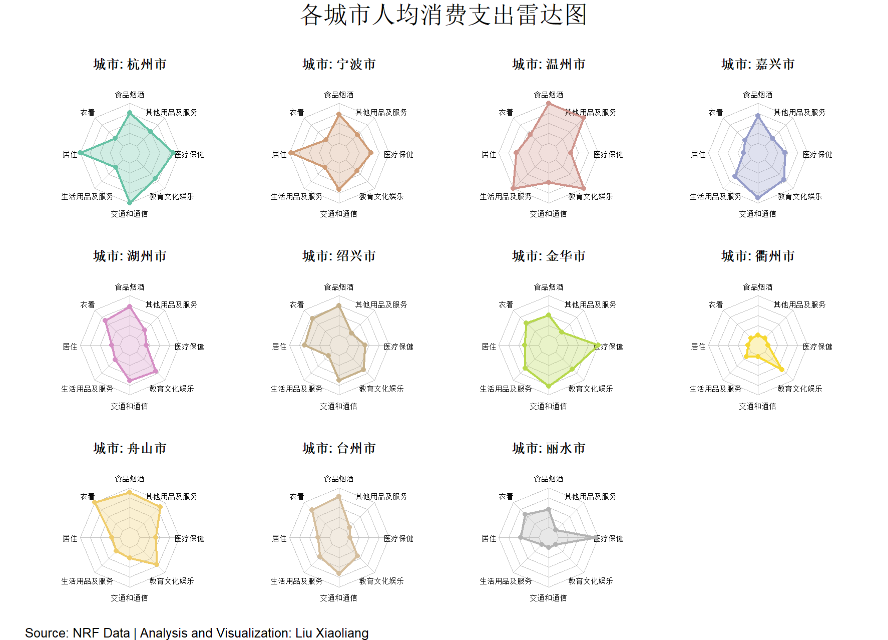

# 一、实验一 ：多元图示分析法
>多元图示分析法（综合性实验）
(Pictorial representations for multivariate data)

## 二、实验要求
>借助计算机软件将多维数据转化为二维平面上的图形，如多联二维散点图（Linking multiple two-dimensional scatter plots）、Radar图、Stars图等，达到识别奇异点（outliers）以及对数据进行初步分类的目的

## 三、实验与解析
### 3.1 第一题

📊 表1-1 分地区城市绿地和园林（2013年）

| 地区  | 城市绿地面积（公顷） | 公园（个） | 公园面积（公顷） | 建成区绿化覆盖率（%） |
| --- | ---------- | ----- | -------- | ----------- |
| 北京  | 68438      | 245   | 13294    | 47.1        |
| 天津  | 23196      | 91    | 2030     | 34.9        |
| 河北  | 76045      | 476   | 15602    | 41.2        |
| 山西  | 36347      | 204   | 8159     | 40.0        |
| 内蒙古 | 49333      | 220   | 11539    | 36.2        |
| 辽宁  | 120514     | 347   | 12877    | 40.2        |
| 吉林  | 38390      | 173   | 5280     | 31.4        |
| 黑龙江 | 75064      | 321   | 9516     | 36.0        |
| 上海  | 124295     | 158   | 2222     | 38.4        |
| 江苏  | 256263     | 842   | 18707    | 42.4        |
| 浙江  | 127927     | 1068  | 15165    | 40.3        |
| 安徽  | 83910      | 312   | 10843    | 39.9        |
| 福建  | 57613      | 529   | 10906    | 42.8        |
| 江西  | 49239      | 297   | 8378     | 45.1        |
| 山东  | 193647     | 733   | 29466    | 42.6        |
| 河南  | 80753      | 290   | 11443    | 37.6        |
| 湖北  | 71622      | 317   | 10680    | 38.1        |
| 湖南  | 53483      | 209   | 9038     | 37.6        |
| 广东  | 411978     | 3258  | 66775    | 41.5        |
| 广西  | 69870      | 183   | 7626     | 37.7        |
| 海南  | 14423      | 48    | 1824     | 42.1        |
| 重庆  | 48123      | 278   | 10123    | 41.7        |
| 四川  | 88894      | 524   | 12204    | 38.4        |
| 贵州  | 34026      | 63    | 4528     | 34.5        |
| 云南  | 34906      | 626   | 6166     | 37.8        |
| 西藏  | 3649       | 64    | 640      | 18.1        |
| 陕西  | 33853      | 173   | 4320     | 40.2        |
| 甘肃  | 21166      | 104   | 3649     | 32.1        |
| 青海  | 4772       | 29    | 949      | 31.2        |
| 宁夏  | 21919      | 69    | 2114     | 38.5        |
| 新疆  | 53562      | 150   | 3778     | 36.4        |

#### (1)试对城市绿地面积、公园个数、公园面积和建成区绿化覆盖率四个变量作多联二维散点图(Linking multiple two-dimensional scatter plots)，并观察有无奇异点(outliers);
```{R}
# 数据准备，这里直接写进来，让AI写进来，不另建数据文件了，免去存储数据的内存
> data <- data.frame(+   地区 = c("北京", "天津", "河北", "山西", "内蒙古", "辽宁", "吉林", "黑龙江", "上海",  
 "江苏", "浙江", "安徽", "福建", "江西", "山东", "河南", "湖北", "湖南",  "广东", "广西", "海南", "重庆", "四川",
  "贵州", "云南", "西藏", "陕西",  "甘肃", "青海", "宁夏", "新疆"),  
  城市绿地面积 = c(68438, 23196, 76045, 36347, 49333, 120514, 38390, 75064, 124295, 256263, 127927, 83910, 57613, 49239, 193647, 80753, 71622, 53483,  411978, 69870, 14423, 48123, 88894, 34026, 34906, 3649, 33853,   21166, 4772, 21919, 53562), 
  公园数量 = c(245, 91, 476, 204, 220, 347, 173, 321, 158, 842, 1068, 312, 529, 297, + 733, 290, 317, 209, 3258, 183, 48, 278, 524, 63, 626, 64, 173, 104, 29, 69, 150),+ 
  公园面积 = c(13294, 2030, 15602, 8159, 11539, 12877, 5280, 9516, 2222, 18707,   15165, 10843, 10906, 8378, 29466, 11443, 10680, 9038, 66775, 7626,  1824, 10123, 12204, 4528, 6166, 640, 4320, 3649, 949, 2114, 3778), 
  建成区绿化覆盖率 = c(47.1, 34.9, 41.2, 40, 36.2, 40.2, 31.4, 36, 38.4, 42.4, 40.3,   39.9, 42.8, 45.1, 42.6, 37.6, 38.1, 37.6, 41.5, 37.7, 42.1, 41.7, 38.4, 34.5, 37.8, 18.1, 40.2, 32.1, 31.2, 38.5, 36.4)+ )
> head(data)   
 地区 城市绿地面积 公园数量 公园面积 建成区绿化覆盖率
1   北京        68438      245    13294             47.1
2   天津        23196       91     2030             34.9
3   河北        76045      476    15602             41.2
4   山西        36347      204     8159             40.0
5 内蒙古        49333      220    11539             36.2
6   辽宁       120514      347    12877             40.2
> dim(data)[1] 31  5
> sum(is.na(data))[1] 0
> #  (data#  (1)试对城市绿地面积、公园个数、公园面积和建成区绿化覆盖率四个变量
> #  作多联二维散点图(Linking multiple two-dimensional scatter plots)，
> #  并观察有无奇异点(outliers);
> A <- data[,2:5]
> pairs(A,main = "城市绿化——多联散点图",pch = 21)
> boxplot(A,col="bisque")
```



##### 找出奇异值：
```{R}
# 找出奇异值
> outliers <- boxplot(A)$out
> outliers
[1] 256263.0 193647.0 411978.0    842.0   1068.0   3258.0  29466.0  66775.0     18.1
# 提取满足条件的行中的特定列
> # 提取包含离群值的行，
> subset_data <- subset(data, 城市绿地面积 %in% outliers, select = c(地区, 城市绿地面积))> print(subset_data)  
 地区 城市绿地面积
10 江苏       256263
15 山东       193647
19 广东       411978
> subset_data <- subset(data, 公园数量 %in% outliers, select = c(地区, 公园数量))
> print(subset_data)   
地区 公园数量
10 江苏      842
11 浙江     1068
19 广东     3258
> subset_data <- subset(data, 公园面积 %in% outliers, select = c(地区, 公园面积))
> print(subset_data)  
 地区 公园面积
15 山东    29466
19 广东    66775
> subset_data <- subset(data, 建成区绿化覆盖率 %in% outliers, select = c(地区,建成区绿化覆盖率))
> print(subset_data)   
地区 建成区绿化覆盖率
26 西藏             18.1
> # 利用Ai将上述8行代码转为一句，此处使用sym动态变量
> library(rlang)
> library(dplyr)
> library(tidyverse)
> columns <- c("城市绿地面积", "公园数量", "公园面积", "建成区绿化覆盖率")
> outlier_results <- lapply(columns, function(col) {+   # 计算当前列的离群值+   data %>%+     filter(!!sym(col) %in% outliers) %>%+     select(地区, !!sym(col))+ })
> outlier_results[[1]]
  地区 城市绿地面积
1 江苏       256263
2 山东       193647
3 广东       411978

[[2]]
  地区 公园数量
1 江苏      842
2 浙江     1068
3 广东     3258

[[3]]
  地区 公园面积
1 山东    29466
2 广东    66775

[[4]]
  地区 建成区绿化覆盖率
1 西藏             18.1
> outliers <- lapply(A, function(x) boxplot.stats(x)$out)
> print(outliers)  # 查看每个变量的离群值$城市绿地面积
[1] 256263 193647 411978

$公园数量
[1]  842 1068 3258

$公园面积
[1] 29466 66775

$建成区绿化覆盖率
[1]18.1
```
##### 离群值分析结果

由此我们看到，数据是存在奇异值的，从多联图中我们看到，数据有集中区域和分散区域，分散区域极有可能是离群点。而从箱型图中我们可以更直观地看到离群值的存在，具体数据如下：

城市绿地面积（公顷）

| 地区 | 城市绿地面积 |
|------|--------------|
| 江苏 | 256263       |
| 山东 | 193647       |
| 广东 | 411978       |

公园数量（个）

| 地区 | 公园数量 |
|------|----------|
| 江苏 | 842      |
| 浙江 | 1068     |
| 广东 | 3258     |

公园面积（公顷）

| 地区 | 公园面积 |
|------|----------|
| 山东 | 29466    |
| 广东 | 66775    |

建成区绿化覆盖率（%）

| 地区 | 绿化覆盖率 |
|------|------------|
| 西藏 | 18.1       |

#### (2)求该数据集的样本均值向量、样本协方差矩阵及样本相关系数矩阵。

##### 样本均值向量

| 指标名称             | 均值         |
|----------------------|--------------|
| 城市绿地面积（公顷） | 78297.42     |
| 公园数量（个）       | 400.03       |
| 公园面积（公顷）     | 10640.03     |
| 建成区绿化覆盖率（%）| 38.13        |

##### 样本相关系数矩阵

|                      | 城市绿地面积 | 公园数量 | 公园面积 | 建成区绿化覆盖率 |
|----------------------|--------------|-----------|-----------|--------------------|
| 城市绿地面积         | 1.0000       | 0.8882    | 0.9106    | 0.3700             |
| 公园数量             | 0.8882       | 1.0000    | 0.9450    | 0.2833             |
| 公园面积             | 0.9106       | 0.9450    | 1.0000    | 0.3682             |
| 建成区绿化覆盖率     | 0.3700       | 0.2833    | 0.3682    | 1.0000             |

##### 样本协方差矩阵

|                      | 城市绿地面积 | 公园数量 | 公园面积 | 建成区绿化覆盖率 |
|----------------------|--------------|-----------|-----------|--------------------|
| 城市绿地面积         | 6700534900.6 | 42504281.8 | 899360245.8 | 158843.5           |
| 公园数量             | 42504281.8   | 341799.6   | 6666320.4   | 868.6              |
| 公园面积             | 899360245.8  | 6666320.4  | 145585835.6 | 23297.8            |
| 建成区绿化覆盖率     | 158843.5     | 868.6      | 23297.8     | 27.5               |


### 3.2 实验题目二：浙江省各市城镇居民人均消费支出分析

数据来源：**2024年浙江统计年鉴**
单位：元/人

📊 表1-2 2023年浙江省各市城镇居民人均消费支出情况

| 项目      | 杭州市   | 宁波市   | 温州市   | 嘉兴市   | 湖州市   | 绍兴市   | 金华市   | 衢州市  | 舟山市   | 台州市   | 丽水市   |
| ------- | ----- | ----- | ----- | ----- | ----- | ----- | ----- | ---- | ----- | ----- | ----- |
| 食品烟酒    | 13062 | 12875 | 14421 | 12625 | 12797 | 12988 | 11559 | 8665 | 13783 | 13138 | 11256 |
| 衣着      | 2580  | 2469  | 2873  | 2447  | 3344  | 3497  | 3159  | 2013 | 4132  | 3540  | 3227  |
| 居住      | 14944 | 14740 | 12461 | 9930  | 10475 | 12848 | 11276 | 9312 | 10488 | 10950 | 11881 |
| 生活用品及服务 | 2482  | 2507  | 4108  | 3180  | 2518  | 2200  | 3183  | 2252 | 2452  | 2868  | 1930  |
| 交通和通信   | 9419  | 7802  | 6898  | 8812  | 7639  | 7630  | 8322  | 4689 | 5810  | 7756  | 4508  |
| 教育文化娱乐  | 5684  | 4746  | 6905  | 5783  | 5768  | 5575  | 5496  | 5556 | 5902  | 4797  | 3380  |
| 医疗保健    | 4148  | 3579  | 3095  | 3352  | 2808  | 3271  | 4467  | 2480 | 3272  | 2527  | 4347  |
| 其他用品及服务 | 1784  | 1629  | 2573  | 1423  | 1439  | 1293  | 1330  | 994  | 2314  | 1169  | 1012  |

#### 3.2.2实验要求：
试利用多元图示分析法（例如Stars图、Radar图等）根据人均消费支出情况对浙江省各市进行大致分类。
注：请说明你做的Stars图是否基于消除量纲后的数据。

```{R}
# plot1--------------------------------------------------------------------
> # 生成Stars图> library(lattice)
> # 同样，利用Ai将数据打进来。当然这里通过先将数据导入为xlsx,csv,或者dat,txt等在导入也可以
> # 创建数据
> data <- data.frame(城市 = c("杭州市", "宁波市", "温州市", "嘉兴市", "湖州市", "绍兴市",  "金华市", "衢州市", "舟山市", "台州市", "丽水市"),食品烟酒 = c(13062, 12875, 14421, 12625, 12797, 12988, 11559, 8665, 13783, 13138, 11256),+   衣着 = c(2580, 2469, 2873, 2447, 3344, 3497, 3159, 2013, 4132, 3540, 3227),+   居住 = c(14944, 14740, 12461, 9930, 10475, 12848, 11276, 9312, 10488, 10950, 11881),生活用品及服务 = c(2482, 2507, 4108, 3180, 2518, 2200, 3183, 2252, 2452, 2868, 1930), 交通和通信 = c(9419, 7802, 6898, 8812, 7639, 7630, 8322, 4689, 5810, 7756, 4508),教育文化娱乐 = c(5684, 4746, 6905, 5783, 5768, 5575, 5496, 5556, 5902, 4797, 3380),医疗保健 = c(4148, 3579, 3095, 3352, 2808, 3271, 4467, 2480, 3272, 2527, 4347), 其他用品及服务 = c(1784, 1629, 2573, 1423, 1439, 1293, 1330, 994, 2314, 1169, 1012), stringsAsFactors = FALSE+ )
> # plot1--------------------------------------------------------------------> # 生成Stars图
> library(lattice)
> x<-data[,1]
#此时的x为factor，我们需要将它转为character类型 
 > x<-as.character(x) 
 > stars(data[, -1], draw.segments = TRUE, col.segments = rainbow(7),+    
 main = "人均消费支出情况", frame.plot = TRUE, labels = x, flip.labels = FALSE, key.labels = dimnames(data)[[2]],  key.xpd = TRUE, key.loc = c(9.4, 2.5), scale = TRUE)
> mtext("Source: AMSA-QJ | Analysis and Visualization: Liu Xiaoliang", side = 2, line = 0, cex =0.8,padj = 0, adj = 0.5, las = 3)  
```



>在stars图的绘制中，是默认消除量纲的。使用参数scale进行控制，如果我们需要
知道它是使用什么方法来进行缩放的，那我们可以直接查它的函数编写语句来确定
page(stars)
 if (scale) {
   x <- apply(x, 2L, function(x) (x - min(x, na.rm = TRUE))/diff(range(x, 
                                                              na.rm = TRUE)))
 }
 我们看到这种对数据进行缩放的方式是极值法，即减去最小值除以极差，如下就是量纲消除函数

 

 ```{R}
library(fmsb)
> library(RColorBrewer)
> library(dplyr)
> city_names <- data$城市> numeric_data <- data[, -1]
> # 计算最大值和最小值
> max_vals <- apply(numeric_data, 2, max)
> min_vals <- apply(numeric_data, 2, min)
> # 颜色方案
> # colors <- brewer.pal(nrow(data), "Set2")
> colors <- colorRampPalette(brewer.pal(8, "Set2"))(nrow(data)) 
> par(mfrow = c(3, 4), mar = c(1, 1, 4, 1), oma = c(2, 2, 3, 2))
> # 绘制每个城市的雷达图
for (i in 1:nrow(data)) {
  city <- city_names[i]
  radar_data <- rbind(max_vals, min_vals, numeric_data[i, ])
  radarchart(
    radar_data,
    axistype = 0, # 显示轴标签
    axislabcol = "black",
    pcol = colors[i],
    pfcol = adjustcolor(colors[i], alpha.f = 0.3),
    plwd = 2,
    cglcol = "grey",
    cglty = 1,
    cglwd = 0.8,
    vlcex = 0.8,
    title = paste("城市:", city)
  )
}> mtext("各城市人均消费支出雷达图", outer = TRUE, cex = 1.5, line = 1)
> mtext("Source: AMSA-QJ  | Analysis and Visualization: Liu Xiaoliang", outer = TRUE, cex = 0.8, side =1, line = 1, adj = 0)
 ```
 

 仅就上述分析而言，浙江省的人均消费支持大致可分为以下三类：
第一类：杭州市，宁波市，温州市
第二类：嘉兴市，湖州市，绍兴市，金华市，舟山市
第三类：衢州市，台州市，丽水市

### 其他说明：
本文使用ai处：数据导入，免去数据读取部分；星星图注释竖版排版；第一问中各奇异值索引函数重写；