# 实验二 多元正态性检验（综合性实验）(Testing multivariate normality)
>实验原理：利用多元正态分布的性质，如边际分布为正态分布等，借助正态情形下直方图及二维散点图的分布特征、置信椭圆、Q－Q图、Chi－square图等图示手段，结合正态检验统计量对给定的多维数据进行正态性检验。

## 一、第一题
习题1.xlsx数据包含了20名男孩在四个年龄阶段的斜骨长度
### 1.1（1）作直方图和两两散点图矩阵；
```{R}
head(df1)
```
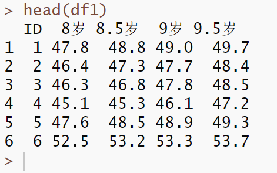
```{R}
df11 <- df1[,-1]
par(mfrow=c(2,2))
hist(df11$`8岁`,main = "8岁斜骨长度分布",xlab="长度")
hist(df11$`8.5岁`,main = "8.5岁斜骨长度分布",xlab="长度")
hist(df11$`9岁`,main = "9岁斜骨长度分布",xlab="长度")
hist(df11$`9.5岁`,main = "9.5岁斜骨长度分布",xlab="长度")
```
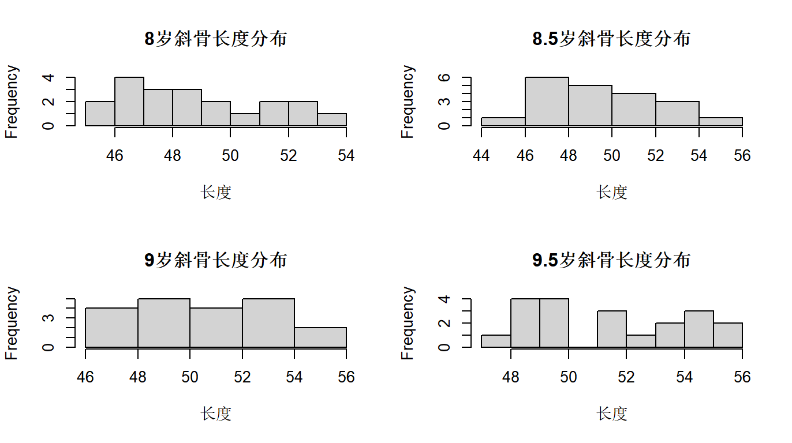
仅就从直方图上来看，四个阶段的斜骨长度分布呈现的特征不太符合正态分布。就像是在正态分布的边缘波动。

我们使用函数话编程再绘制以下这个图
```{R}
ages  <- names(df11)    
 # c("8岁", "8.5岁", "9岁", "9.5岁")
par(mfrow = c(2, 2),      # 2×2 布局
    mar   = c(4, 4, 2, 1)) # 调整一下边距
for (age in ages) {
  hist(df11[[age]],
       main  = paste0(age, " 斜骨长度分布"),
       xlab  = "长度",
       breaks= "Sturges")
}
```
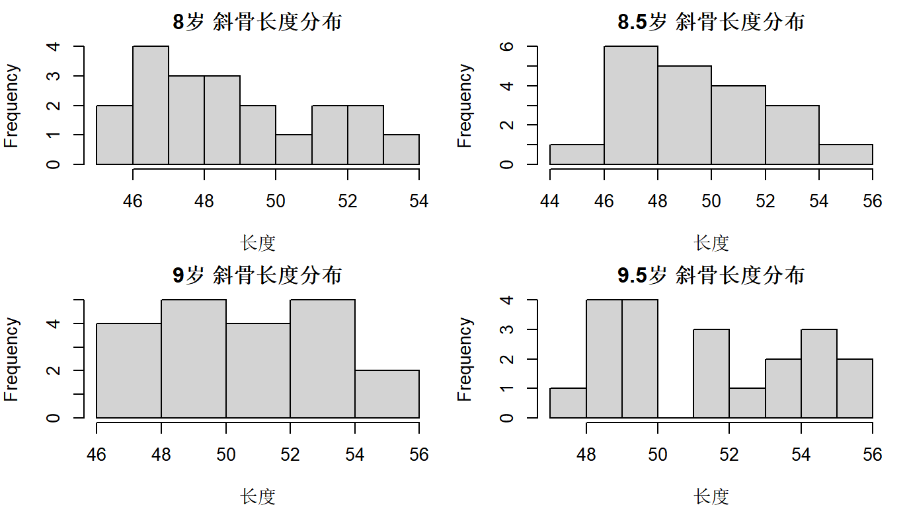
两两散点图矩阵如下：
```{R}
pairs(df11,
      labels   = ages,
      main     = "8–9.5 岁斜骨长度两两散点图矩阵",
      pch      = 20,
      cex      = 0.6)
```
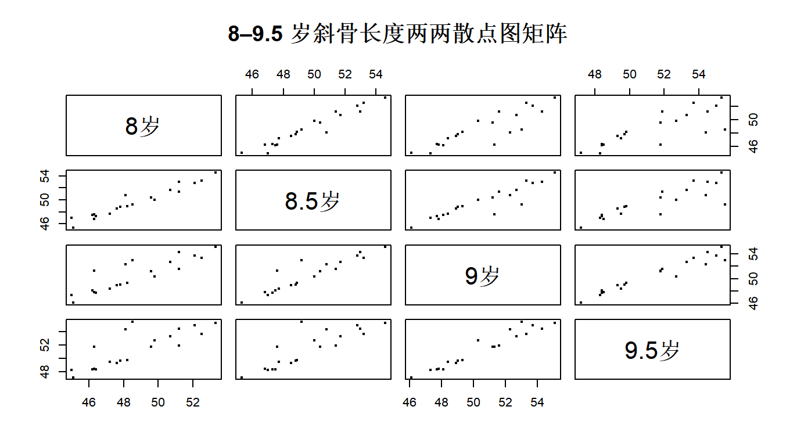
关于两两散点图，再car包中也有一个不错的函数
```{R}
library(car)
scatterplotMatrix(df11,
                  smooth = TRUE,
                  diagonal = "density",  # 对角线上显示密度图
                  reg.line = lm,
                  #ellipse = TRUE,        # 显示置信椭圆
                  pch = 21,
                  col = "blue",
                  main = "斜骨长度两两散点图（含拟合线和密度）")
```
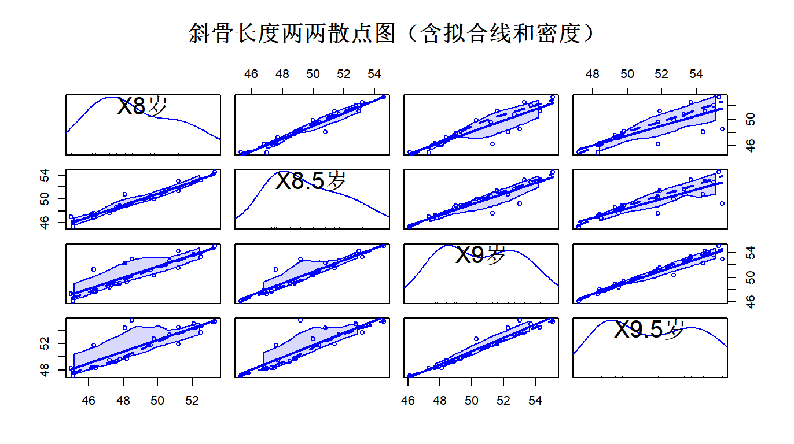

### 1.2（2）求样本均值向量、样本协方差矩阵、样本相关系数矩阵；
```{R}
colMeans(df11)
cov(df11)
cor(df11)
```
---

当然，以下是将你提供的均值向量、协方差矩阵和相关系数矩阵使用 Markdown 语法重写的版本，无需数学公式格式：

---

📌 均值向量（Mean Vector）

```
x̄ = 
[48.655  
 49.625  
 50.570  
 51.450]
```

---

📌 协方差矩阵（Covariance Matrix）

```
Cov = 
[6.330  6.189  5.777  5.548  
 6.189  6.449  6.153  5.923  
 5.777  6.153  6.918  6.946  
 5.548  5.923  6.946  7.465]
```

---
📌 相关系数矩阵（Correlation Matrix）

```
Cor = 
[1.000  0.969  0.873  0.807  
 0.969  1.000  0.921  0.854  
 0.873  0.921  1.000  0.967  
 0.807  0.854  0.967  1.000]
```

---


### 1.3（3）分别作每个变量的Q－Q图，并判断一元正态性；
```{R}
par(mfrow = c(2, 2))
for (col in ages) {
  qqnorm(df11[[col]], main = paste0(gsub("X", "", col), " Q-Q图"))
  qqline(df11[[col]])
}
```
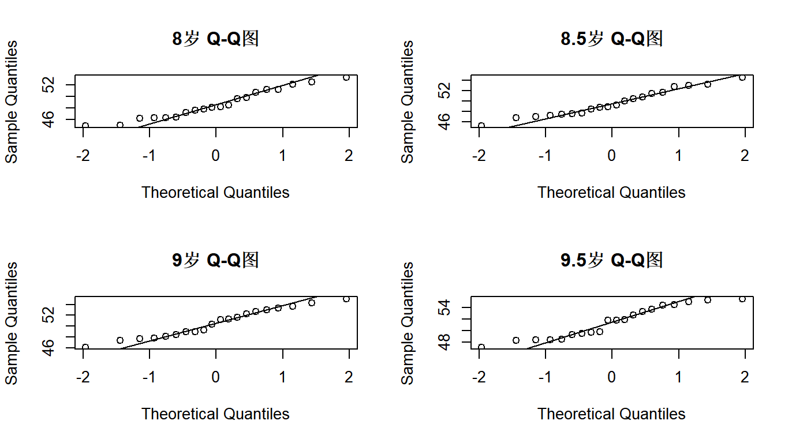
依据QQ图判断一元正态性是否满足，在于观察样本点是否落在直线上，越接近直线表示正态性越好。就目前的图来看，似乎满足，但是实际上，我们可以通过统计量来对我们的初始判断进行检验。
> Shapiro 检验，原假设是数据服从正态分布。

```{R}
for (col in ages) {
  cat(col, ": p值 = ", shapiro.test(df11[[col]])$p.value, "\n")
}
```
8岁 : p值 =  0.3360253 
8.5岁 : p值 =  0.6019545 
9岁 : p值 =  0.5016248 
9.5岁 : p值 =  0.09051021 
**P值都大于0.05，因此我们认为数据近似服从正态分布。**
### 1.4（4）计算每一个观测值到样本均值向量的统计距离平方；
也就是计算马氏距离
```{R}
m_dist <- mahalanobis(df11, center = colMeans(df11), cov = cov(df11))
m_dist
```
| 样本序号 | 马氏距离平方 |
| -------- | ------------ |
| 1        | 0.7589       |
| 2        | 1.2974       |
| 3        | 1.7542       |
| 4        | 3.8608       |
| 5        | 0.8776       |
| 6        | 2.8222       |
| 7        | 4.0573       |
| 8        | 8.1106       |
| 9        | 10.9512      |
| 10       | 5.8462       |
| 11       | 2.8393       |
| 12       | 10.5795      |
| 13       | 2.5797       |
| 14       | 0.6625       |
| 15       | 0.3325       |
| 16       | 0.8462       |
| 17       | 1.1142       |
| 18       | 4.4104       |
| 19       | 2.1249       |
| 20       | 10.1742      |

我们还可以直接依据公式手算
```{R}
mu <- colMeans(df11)
S <- cov(df11)
# 逐个样本计算统计距离平方
D2 <- apply(df11, 1, function(x) {
  diff <- as.matrix(x - mu)               
    # 差向量 (x - mu)
  t(diff) %*% solve(S) %*% diff           
   # 矩阵乘法：转置(diff) × Σ⁻¹ × diff
})
head(D2)
```
0.7589305 1.2973512 1.7542420 3.8608496 0.8776488 2.8221570
添加统计距离到源数据并绘图
```{R}
df11$D2 <- as.vector(D2)
plot(df11$D2, type = "h", main = "统计距离平方分布", ylab = "D²")
abline(h = qchisq(0.975, df = ncol(df11) - 1), col = "red", lty = 2)  # 置信阈值线
```
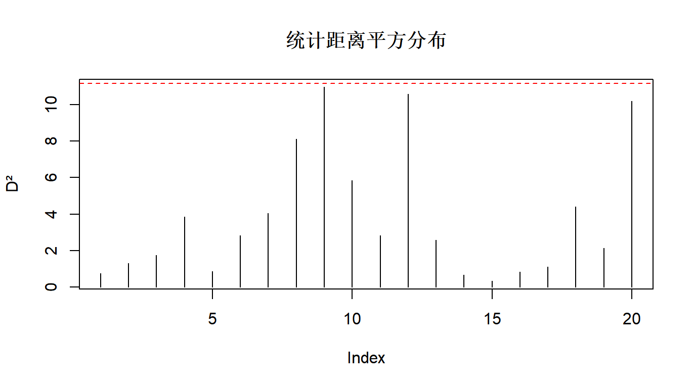
### 1.5（5）计算观测点落在多元正态50％置信区域内的比率；
复杂一点，详细代码
```{R}
p <- ncol(df11[,-5])                    
   # 变量维度，这里-5是因为我们前面添加了统计距离
alpha <- 0.50                      
 # 50%置信水平
threshold <- qchisq(alpha, df = p) 
# 卡方分布50%分位数
# 计算落入置信区域的观测点数
inside_count <- sum(m_dist <= threshold)
# 计算比例
ratio_inside <- inside_count / nrow(df11)
cat("落在50%多元正态置信区域内的观测点比例：", ratio_inside, "\n")
```
落在50%多元正态置信区域内的观测点比例： 0.6

简单代码，一行搞定
```{R}
ratio<-sum(m_dist<=qchisq(0.5,df=4))/nrow(df11)
ratio
```
### 1.6（6）作Chi-square图；
```{R}
chi <- qchisq(ppoints(nrow(df11)), df = ncol(df11[,-5])) 
 # n = 样本数，df = 变量数
par(mfrow = c(1, 1))
plot(chi, sort(m_dist),
     main = "Chi-square Q-Q图",
     xlab = "理论卡方分位数",
     ylab = "样本马氏距离平方",
     pch = 19, col = "#336699")
abline(0, 1, col = "#66CCFF", lwd = 2)  
# 理论线
```
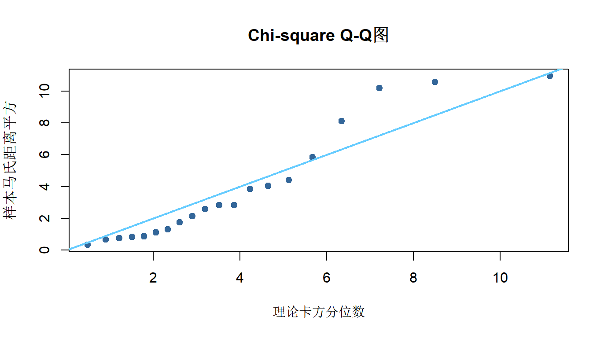
同样，我们做个检验
```{R}
library(MVN)
result <- mvn(data = df11, mvnTest = "hz", 
multivariatePlot = "qq")
print(result$multivariateNormality)
```

### 1.7（7）综合以上分析结果判断四元正态性是否成立。
边际变量都近似正态、马氏距离也接近卡方分布，但整体联合分布仍未能满足多元正态。该数据集不满足严格的四元正态分布要求。它近似服从多元正态分布，但严格意义下未通过统计检验。

## 第二题
>表1给出了2020年浙江省各市、县三次产业总值（单位：亿元）数据在习题2.xlsx文件中。

### （1）作直方图和两两散点图矩阵；
```{R}
df2 <- readxl::read_excel("习题2.xlsx")
head(df2)
df21 <- df2[,-1]
head(df21)
name <- colnames(df21)
par(mfrow = c(2, 2),      # 2×2 布局
    mar   = c(4, 4, 2, 1)) # 调整一下边距
for (i in name) {
  hist(df21[[i]],
       main  = paste0(i, "产值"),
       xlab  = "产值",
       ylab = "频数",
       breaks= "Sturges")
}
```
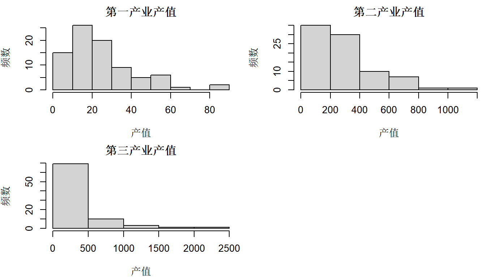
```{R}
pairs(df21,
      labels   = name,
      main     = "浙江省产值两两散点图矩阵",
      pch      = 20,
      cex      = 0.6)
```
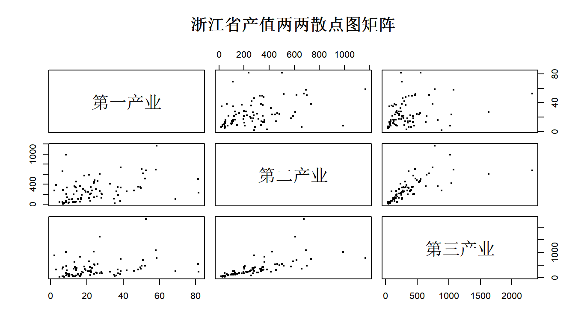
显然正态性不满足
### （2）求样本均值向量、样本协方差矩阵、样本相关系数矩阵；
```{R}
colMeans(df21)
cov(df21)
cor(df21)
```

colMeans(df21)
 第一产业  第二产业  第三产业 
 24.88548 283.67881 353.87036 
cov(df21)
          第一产业  第二产业  第三产业
第一产业  301.3829  1491.951   1715.04
第二产业 1491.9508 50865.795  56152.25
第三产业 1715.0403 56152.246 125133.28
 cor(df21)
          第一产业  第二产业  第三产业
第一产业 1.0000000 0.3810503 0.2792728
第二产业 0.3810503 1.0000000 0.7038300
第三产业 0.2792728 0.7038300 1.0000000

### （3）分别作每个变量的Q－Q图，并判断一元正态性；
```{R}
par(mfrow = c(2, 2))
for (i in name) {
  qqnorm(df21[[i]], main = paste0(gsub("X", "", i), " Q-Q图"))
  qqline(df21[[i]])
}
# 统计量检验正态性
for (i in name) {
  cat(i, ": p值 = ", shapiro.test(df21[[i]])$p.value, "\n")
}
```
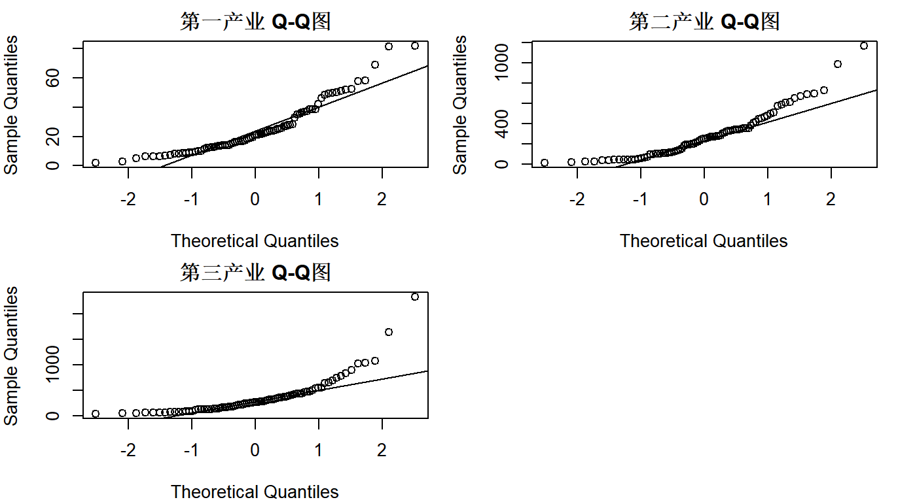
第一产业 : p值 =  1.574653e-06 
第二产业 : p值 =  2.476335e-06 
第三产业 : p值 =  1.791158e-11 
拒绝原假设，数据不满足正态性
### （4）作Chi-square图；
```{R}
# Chi-square图（用于判断多元正态性）
d <- apply(df21, 1, function(z) {
  t(z - colMeans(df21)) %*% solve(cov(df21)) %*% (z - colMeans(df21))
})
d.sort <- sort(d)
q <- qchisq((1:nrow(df21) - 0.5) / nrow(df21), df = ncol(df21))  # 自适应自由度
plot(q, d.sort, xlab = "理论卡方分位数", ylab = "样本马氏距离平方", main = "Chi-square图")
abline(0, 1, col = "blue", lwd = 2)
```
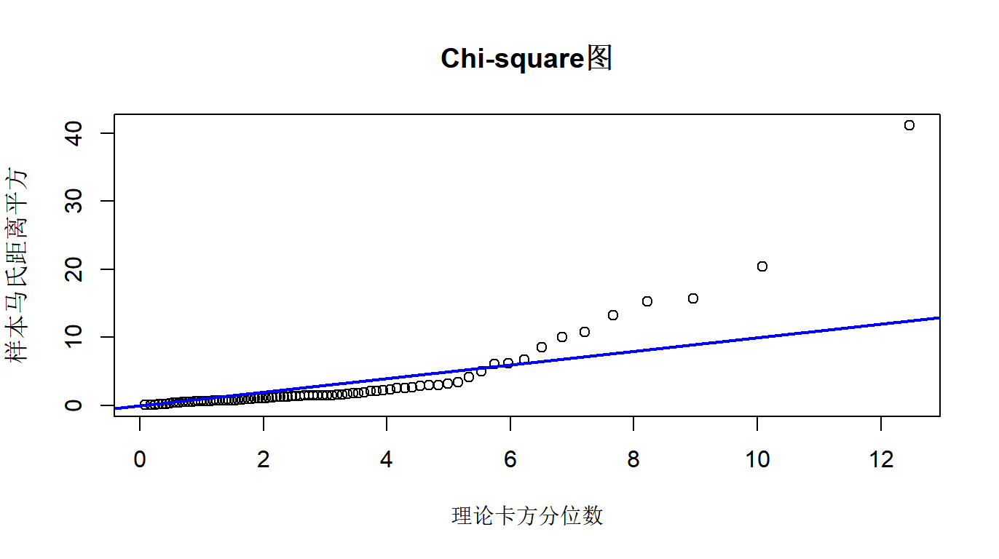
显然，不服从正态分布
### （5）观察是否有奇异点；
```{R}
# 取出三列产业数据向量
v1 <- as.vector(df2$`第一产业`)
v2 <- as.vector(df2$`第二产业`)
v3 <- as.vector(df2$`第三产业`)
# 分别找出各列的异常值索引
iny1 <- which(v1 %in% boxplot.stats(v1)$out)
iny2 <- which(v2 %in% boxplot.stats(v2)$out)
iny3 <- which(v3 %in% boxplot.stats(v3)$out)
# 输出市县名称及其异常值
cat("【第一产业】异常值市县及其值：\n")
print(df2[iny1, c("市县名称", "第一产业")])
cat("\n【第二产业】异常值市县及其值：\n")
print(df2[iny2, c("市县名称", "第二产业")])
cat("\n【第三产业】异常值市县及其值：\n")
print(df2[iny3, c("市县名称", "第三产业")])
```

【第一产业】异常值市县及其值：
  市县名称 第一产业
1 象山县       81.7
2 普陀区       68.9
3 温岭市       81.4

【第二产业】异常值市县及其值：
  市县名称 第二产业
1 北仑区       990.
2 慈溪市      1168.

【第三产业】异常值市县及其值：
  市县名称 第三产业
1 萧山区      1077.
2 余杭区      2322.
3 北仑区      1022.
4 鄞州区      1630.
5 鹿城区       890.
6 义乌市      1040.

### （6）综合以上分析结果判断多元正态性。
- 浙江省二、三产业发达，协同推进，相互依托，第一产业产值相对较低，但依然可观
- 依据 QQ 图，一、二、三产业总值均不服从正态分布
存在奇异点，
- 产业发展格局存在地域特征，区域间发展各有特色
- 由以上分析可知，多元正态性条件不成立，可以认为：数据不服从多元正态分布
## 附录
### 第二题地图绘制
```{R}
plot_gansu_map <- function(map_file, data) {
  library(dplyr)
  library(sf)
  library(ggplot2)
  library(ggspatial)
  library(ggrepel)
  library(tidyr)
  map_data <- st_read(map_file, quiet = TRUE)  # 读取地图数据
  people_data <- data[, c(1, 2)]  # 仅选择数据列
  map_data$name <- trimws(map_data$name)  # 确保名称匹配（去除空格）
  people_data$市县名称 <- trimws(people_data$市县名称)
  map_data <- merge(map_data, people_data, by.x = "name", by.y = "市县名称", all.x = TRUE)  # 合并数据
  map_data <- map_data %>% mutate(across(everything(), ~replace_na(., 0)))  # 替换 NA 为 0
  fill_column <- colnames(data)[2]  # 获取用于填充的列名（动态选择）
  p <- ggplot(map_data) +
    theme_bw() +
    geom_sf(color = 'black', size = 0.4, aes(fill = .data[[fill_column]])) +  # 用动态列填充
    scale_fill_gradient(low = "#FFDAB9", high = "#07519c", name = fill_column) +  # 颜色梯度填充
    geom_text_repel(aes(label = name, geometry = geometry),
                    stat = "sf_coordinates",
                    size = 3,
                    color = "black",
                    min.segment.length = 0,  # 确保线段始终绘制
                    segment.color = "gray50",
                    box.padding = 0.1,  # 标签与点的距离
                    point.padding = 0.3) +
    annotation_north_arrow(location = "tl", which_north = FALSE,
                           pad_x = unit(0.05, "in"),
                           pad_y = unit(0.05, "in"),
                           style = north_arrow_fancy_orienteering) +
    annotation_scale(location = "bl", width_hint = 0.3) +
    theme(axis.text = element_text(size = 12, color = "black"),
          axis.line = element_blank(),
          panel.background = element_rect(fill = "#f5f6f1"),  # 地图底层颜色
          legend.background = element_rect(fill = alpha("#ffffff", 0.6), color = "black"),  # 半透明背景
          legend.title = element_text(size = 10, face = "bold"),
          legend.text = element_text(size = 10),
          legend.key.size = unit(0.6, "lines"),
          legend.spacing = unit(0.2, "lines"),
          legend.margin = margin(t = 2, r = 2, b = 2, l = 2, unit = "mm"),
          legend.position = c(0.88, 0.17)) +  # 图例在右下角
    coord_sf(crs = "+proj=laea +lat_0=40 +lon_0=104") +  # 投影
    labs(x = '', y = '', color = NULL)
  
  return(p)
}
data1 <- df2[, c(1, 2)]  # 第一产业
p1 <- plot_gansu_map("浙江省.json", data1)
p1
data2 <- df2[, c(1, 3)]  # 第二产业
p2 <- plot_gansu_map("浙江省.json", data2)
p2
data3 <- df2[, c(1, 4)]  # 第二产业
p3 <- plot_gansu_map("浙江省.json", data3)
p3
library(patchwork)
p4 <- p1 + ggtitle("a.第一产业") +
  theme(plot.title = element_text(hjust = 0, vjust = -1, size = 12, face = "bold"))  # 调整标题位置和样式
p5 <- p2 + ggtitle("b.第二产业") +
  theme(plot.title = element_text(hjust = 0, vjust = -1, size = 12, face = "bold"))  # 调整标题位置和样式
p6 <- p2 + ggtitle("c.第三产业") +
  theme(plot.title = element_text(hjust = 0, vjust = -1, size = 12, face = "bold"))  # 调整标题位置和样式
combined_plot <- p4+ p5+p6 + plot_layout(ncol = 3)  # 按列排列，每行 3列
print(combined_plot)
```

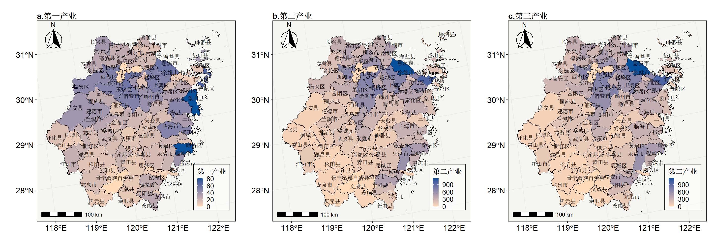

### 其他说明
本章节与之对应的还有一次汇报PPT，此处省略。