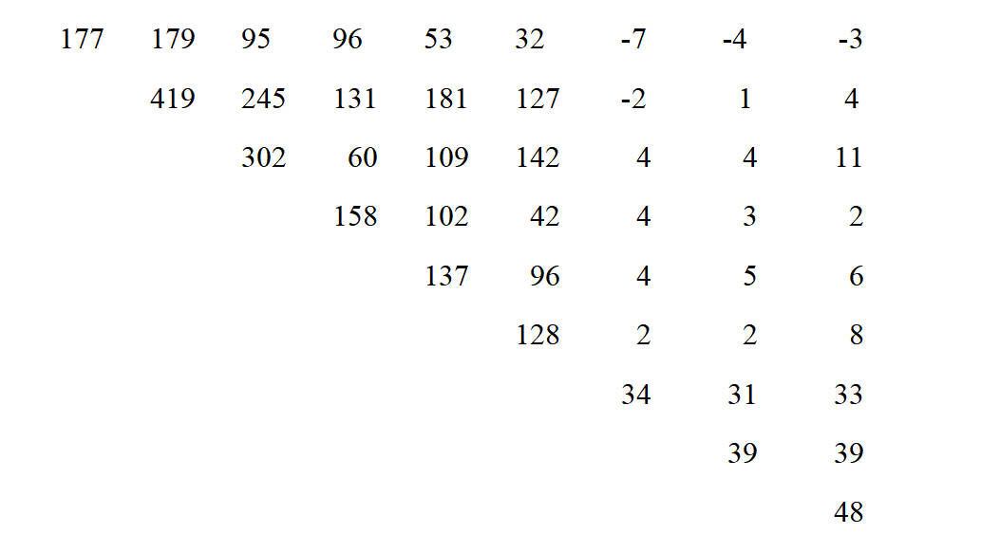

# 实验三 主成分分析(Principal component analysis)
>主成分分析利用指标之间的相关性，将多个指标转化为少数几个综合指标，从而达到降维和数据结构简化的目的。这些综合指标反映了原始指标的绝大部分信息，通常表示为原始指标的某种线性组合，且综合指标间不相关。利用矩阵代数的知识可求解主成分。
期望公式：

## 实验题目一
实验题目一：将彩色胶卷在显影液下处理后在不同情形下曝光，然后通过红、绿、蓝三种滤色片并在高、中、低三种密度下进行测量，每个胶卷有高红、高绿、高蓝、中红、…、低蓝等九个指标（分别记为X1－X9九个变量）。试验了108个胶卷，由数据已算得如下协差阵： (S2a1)



实验要求：

### （1）试从协差阵出发进行主成分分析；
# 定义上三角协方差矩阵数据
```{R}
sigma <- matrix(c(
  177, 179, 95, 96, 53, 32, -7, -4, -3,
  179, 419, 245, 131, 181, 127, -2, 1, 4,
  95, 245, 302, 60, 109, 142, 4, 4, 11,
  96, 131, 60, 158, 102, 42, 4, 3, 2,
  53, 181, 109, 102, 137, 96, 4, 5, 6,
  32, 127, 142, 42, 96, 128, 2, 2, 8,
  -7, -2, 4, 4, 4, 2, 34, 31, 33,
  -4, 1, 4, 3, 5, 2, 31, 39, 39,
  -3, 4, 11, 2, 6, 8, 33, 39, 48
), nrow = 9, byrow = TRUE)

pca_result <- princomp(covmat = sigma)

```
### （2）计算方差累积贡献率；
# 计算各主成分的方差贡献率和累积贡献率
```{R}
var_prop <- pca_result$sdev^2 / sum(pca_result$sdev^2)
cum_prop <- cumsum(var_prop)
cat("各主成分的方差贡献率：\n")
print(round(var_prop * 100, 2))
cat("\n累积贡献率：\n")
print(round(cum_prop * 100, 2))
```
### （3）作Scree图，并结合（2）的结果确定主成分的个数；
```{R}
plot(1:length(var_prop), 
     var_prop, 
     type = "b", 
     xlab = "主成分", 
     ylab = "方差贡献率",
     main = "Scree图")
abline(h = 1/length(var_prop), 
col = "red", lty = 2)
```
### （4）计算主成分与原始变量的相关系数；
```{R}
loadings <- pca_result$loadings
correlations <- loadings * sqrt(pca_result$sdev^2)
cat("\n主成分与原始变量的相关系数：\n")
print(round(correlations, 3))
```
### （5）试对结果进行解释。
```{R}
summary(pca_result)
```
第二题且先放一放