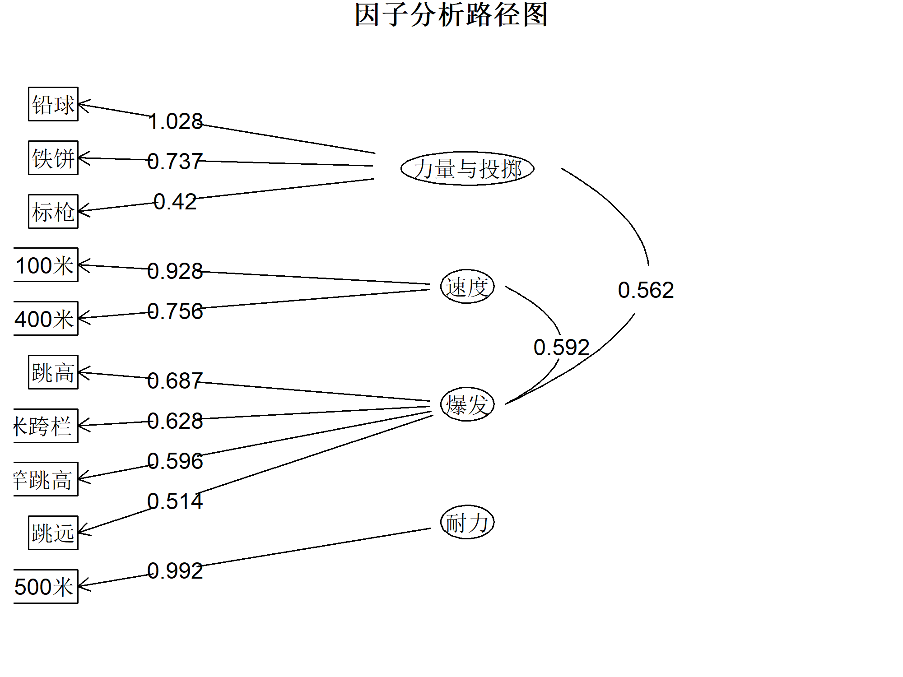

# 实验四正交因子分析(Orthogonal factor analysis)

## 实验题目一：
下表中给出了二战以来奥运会运动员十项运动成绩的相关系数矩阵：(E9a6)

实验要求：
### （1）试由相关系数矩阵作因子分析；
```{R}
library(FactoMineR)

# （1）试由相关系数矩阵作因子分析；
# （2）试根据因子载荷，并结合题目背景知识，对公共因子进行命名。

# （1）试由相关系数矩阵作因子分析；

# 定义项目名称和相关矩阵
projects <- c("100米", "跳远", "铅球", "跳高", "400米", "110米跨栏", "铁饼", "撑竿跳高", "标枪", "1500米")
cor_matrix <- matrix(c(
  1.00, 0.59, 0.35, 0.34, 0.63, 0.40, 0.28, 0.20, 0.11, -0.07,
  0.59, 1.00, 0.42, 0.51, 0.49, 0.52, 0.31, 0.36, 0.21, 0.09,
  0.35, 0.42, 1.00, 0.38, 0.19, 0.36, 0.73, 0.24, 0.44, -0.08,
  0.34, 0.51, 0.38, 1.00, 0.29, 0.46, 0.27, 0.39, 0.17, 0.18,
  0.63, 0.49, 0.19, 0.29, 1.00, 0.34, 0.17, 0.23, 0.13, 0.39,
  0.40, 0.52, 0.36, 0.46, 0.34, 1.00, 0.32, 0.33, 0.18, 0.00,
  0.28, 0.31, 0.73, 0.27, 0.17, 0.32, 1.00, 0.24, 0.34, -0.02,
  0.20, 0.36, 0.24, 0.39, 0.23, 0.33, 0.24, 1.00, 0.24, 0.17,
  0.11, 0.21, 0.44, 0.17, 0.13, 0.18, 0.34, 0.24, 1.00, -0.00,
  -0.07, 0.09, -0.08, 0.18, 0.39, 0.00, -0.02, 0.17, -0.00, 1.00
), nrow = 10, ncol = 10, byrow = TRUE)
dimnames(cor_matrix) <- list(projects, projects)

#KMO 检验
library(psych)
kmo_test <- KMO(cor_matrix)
print(kmo_test)

#Bartlett 的球形度检验
bartlett_test <- cortest.bartlett(cor_matrix)
print(bartlett_test)

library(psych)
library(qgraph)
#进行因子分析（4个因子 + Promax 旋转）
fa_result <- fa(cor_matrix, nfactors = 4, rotate = "promax", fm = "ml")
colnames(fa_result$loadings) <- c("力量与投掷", "速度", "爆发", "耐力")
```
这里需要注意的是，对于相关系数矩阵，我适用了cortest.bartlett检验。
### （2）试根据因子载荷，并结合题目背景知识，对公共因子进行命名。

```{R}
# **方法 2：使用 qgraph 美化**
library(psych)
library(qgraph)

#进行因子分析（4个因子，Promax 旋转）
fa_result <- fa(cor_matrix, nfactors = 4, rotate = "promax", fm = "ml")
loading_matrix <- as.matrix(fa_result$loadings)
print(fa_result$loadings, cutoff = 0.4)
factor_names <- c("力量与投掷", "速度", "爆发", "耐力")
colnames(loading_matrix) <- factor_names

#扩展邻接矩阵：让它变成方阵
n_projects <- nrow(loading_matrix)
n_factors <- ncol(loading_matrix)
n_total <- n_projects + n_factors  # 总节点数（项目 + 因子）

adj_matrix <- matrix(0, nrow = n_total, ncol = n_total)  # 初始化空方阵
adj_matrix[1:n_projects, (n_projects + 1):n_total] <- loading_matrix  # 变量连接因子

#定义节点名称
node_names <- c(rownames(loading_matrix), factor_names)  # 运动项目 + 因子

#设置节点颜色
node_colors <- c(rep("lightblue", n_projects),  # 运动项目（蓝色）
                 rep("tomato", n_factors))      # 因子（红色）

#使用 qgraph 绘图
qgraph(adj_matrix, layout = "spring", 
       vsize = c(rep(8, n_projects), rep(12, n_factors)),  # 因子点更大
       esize = 3,  # 线条大小
       edge.color = "darkblue",  # 连接线颜色
       labels = node_names,  # 正确的因子+项目名称
       label.cex = 1.2,  # 文字大小
       color = node_colors  # 区分因子 & 项目
       #title = "因子分析路径图"
       )
```


还有一种绘图方法，不过绘制得图有问题，不怎么推荐
```{R}
library(psych)
library(qgraph)

#进行因子分析（4个因子 + Promax 旋转）
fa_result <- fa(cor_matrix, nfactors = 4, rotate = "promax", fm = "ml")
colnames(fa_result$loadings) <- c("力量与投掷", "速度", "爆发", "耐力")

#fa.diagram()
#先绘制因子分析路径图
fa.diagram(fa_result, digits = 3, main = "因子分析路径图",
           simple = FALSE, cut = 0.4, sort = TRUE, cex = 1.5)
par(mar = c(4, 8, 4, 2))  # 增大左侧边距
png("factor_diagram.png", width = 2000, height = 1500, res = 300)
fa.diagram(fa_result, digits = 3, main = "因子分析路径图",
           simple = FALSE, cut = 0.4, sort = TRUE, cex = 1.5)
dev.off()
```


第二题与其类型相同，不过多了得分排名，先放一放