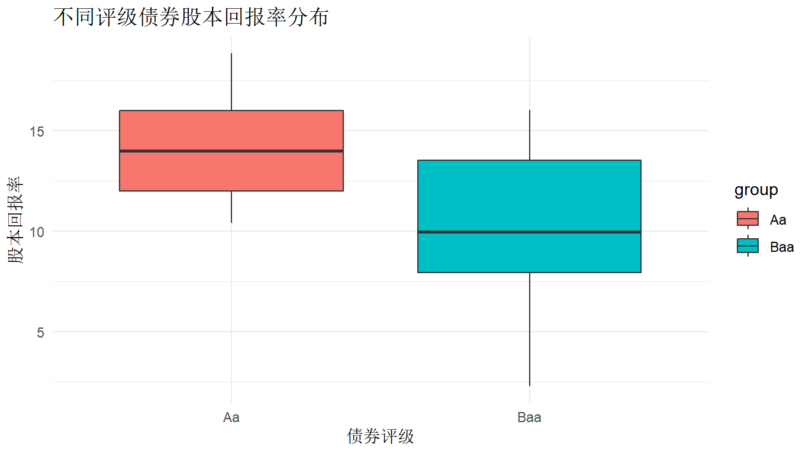
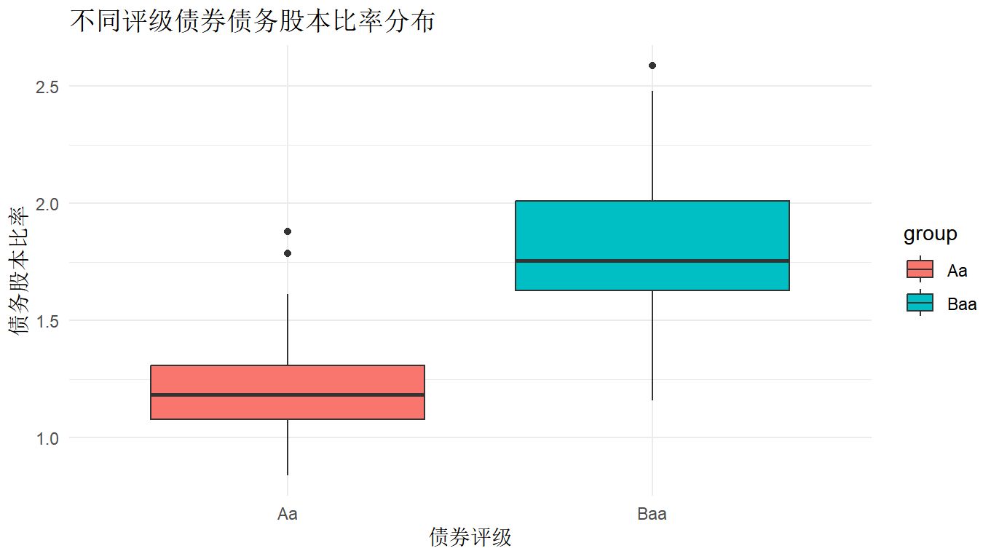
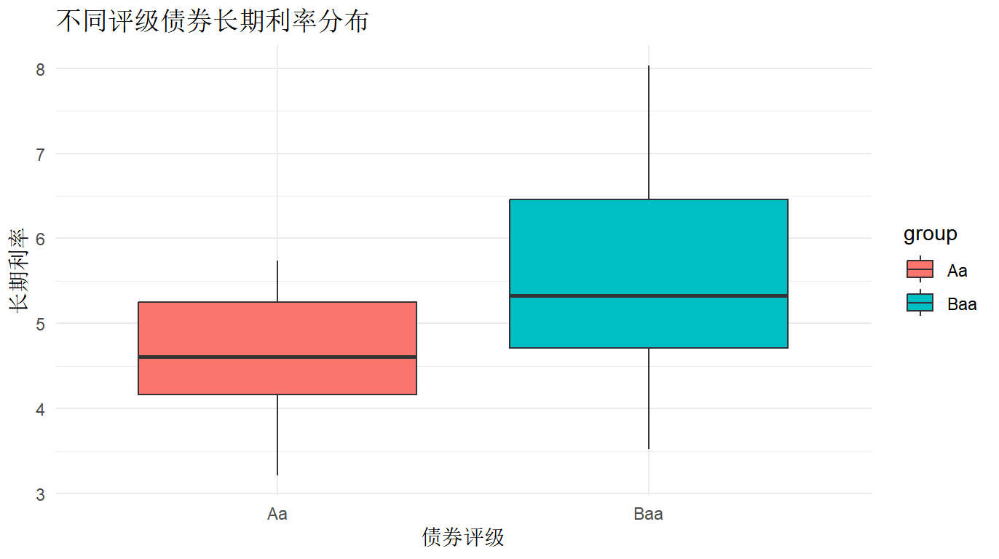
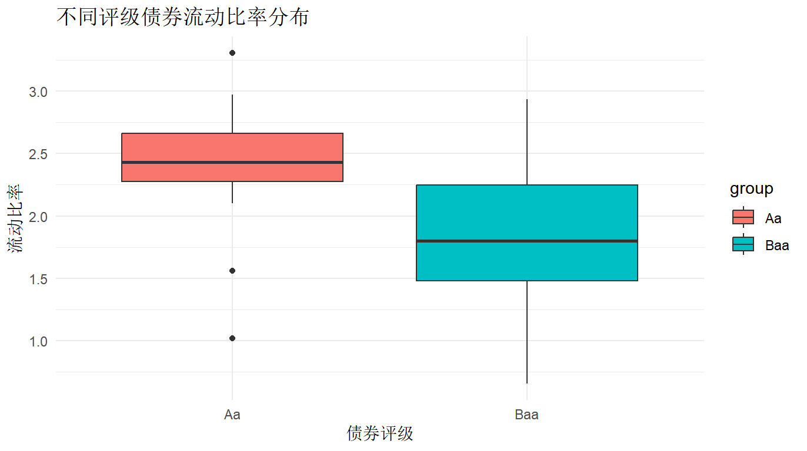
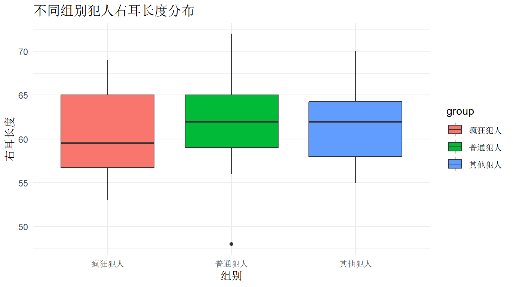
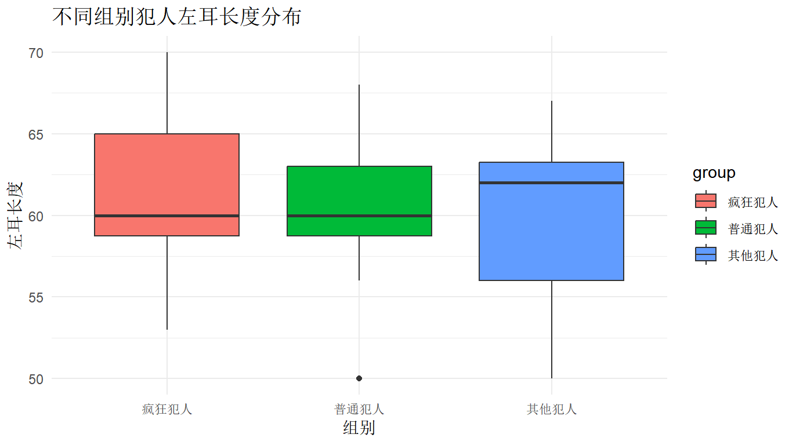

# 实验七
```{R}
#实验七：单因素多元方差分析
#加载必要的包
library(MASS)
library(car)
library(mvnormtest)
library(ggplot2)

#--------------------------第一题：犯人耳朵长度分析-------------------------------

#创建数据框
normal_prisoners <- data.frame(
  left_ear = c(59, 60, 58, 59, 50, 59, 62, 63, 68, 63, 66, 56, 62, 66, 65, 61, 60, 60, 58, 58),
  right_ear = c(59, 65, 62, 59, 48, 65, 62, 62, 72, 66, 63, 56, 64, 68, 66, 60, 64, 57, 60, 59),
  group = "普通犯人"
)

crazy_prisoners <- data.frame(
  left_ear = c(70, 69, 65, 62, 59, 55, 60, 58, 65, 67, 60, 53, 66, 60, 59, 58, 60, 54, 62, 59),
  right_ear = c(69, 68, 65, 60, 56, 58, 58, 64, 67, 62, 57, 55, 65, 53, 58, 54, 56, 59, 66, 61),
  group = "疯狂犯人"
)

other_prisoners <- data.frame(
  left_ear = c(63, 56, 62, 59, 62, 50, 63, 61, 55, 63, 65, 64, 65, 67, 55, 56, 65, 62, 55, 58),
  right_ear = c(63, 57, 62, 58, 58, 57, 63, 62, 59, 63, 70, 64, 65, 67, 55, 56, 67, 65, 61, 58),
  group = "其他犯人"
)

#合并数据
prisoners_data <- rbind(normal_prisoners, crazy_prisoners, other_prisoners)
prisoners_data$group <- factor(prisoners_data$group)

#(1) 检验前提条件
#正态性检验
#对每个组分别进行Shapiro-Wilk检验
normal_test <- by(prisoners_data[, 1:2], prisoners_data$group, function(x) {
  apply(x, 2, shapiro.test)
})
print("正态性检验结果：")
print(normal_test)

#方差齐性检验
#使用Box's M检验
box_m_test <- function(x, y) {
  n1 <- nrow(x)
  n2 <- nrow(y)
  p <- ncol(x)
  
  S1 <- cov(x)
  S2 <- cov(y)
  S_pooled <- ((n1-1)*S1 + (n2-1)*S2)/(n1+n2-2)
  
  M <- (n1+n2-2)*log(det(S_pooled)) - (n1-1)*log(det(S1)) - (n2-1)*log(det(S2))
  c <- (2*p^2 + 3*p - 1)/(6*(p+1)) * (1/(n1-1) + 1/(n2-1) - 1/(n1+n2-2))
  
  chi_sq <- M*(1-c)
  df <- p*(p+1)/2
  
  p_value <- 1 - pchisq(chi_sq, df)
  return(list(statistic = chi_sq, p_value = p_value))
}

#对三组进行两两比较
groups <- split(prisoners_data[, 1:2], prisoners_data$group)
box_m_results <- list(
  normal_crazy = box_m_test(groups[[1]], groups[[2]]),
  normal_other = box_m_test(groups[[1]], groups[[3]]),
  crazy_other = box_m_test(groups[[2]], groups[[3]])
)
print("Box's M检验结果：")
print(box_m_results)

#(2) 多元方差分析
# 使用manova函数进行多元方差分析
manova_result <- manova(cbind(left_ear, right_ear) ~ group, data = prisoners_data)
summary(manova_result, test = "Wilks")
summary(manova_result, test = "Pillai")
summary(manova_result, test = "Hotelling-Lawley")
summary(manova_result, test = "Roy")

#绘制箱线图
#左耳长度箱线图
ggplot(prisoners_data, aes(x = group, y = left_ear, fill = group)) +
  geom_boxplot() +
  labs(title = "不同组别犯人左耳长度分布",
       x = "组别",
       y = "左耳长度") +
  theme_minimal()

#右耳长度箱线图
ggplot(prisoners_data, aes(x = group, y = right_ear, fill = group)) +
  geom_boxplot() +
  labs(title = "不同组别犯人右耳长度分布",
       x = "组别",
       y = "右耳长度") +
  theme_minimal()

#--------------------------第二题：公司债券财务特征分析-------------------------------

#创建数据框（这里使用示例数据，实际数据需要根据题目提供的数据进行修改）
aa_bonds <- data.frame(
  current_ratio = rnorm(20, mean = 2.5, sd = 0.5),  # 流动比率
  long_term_rate = rnorm(20, mean = 4.5, sd = 0.8),  # 长期利率
  debt_equity_ratio = rnorm(20, mean = 1.2, sd = 0.3),  # 债务股本比率
  roe = rnorm(20, mean = 15, sd = 3),  # 股本回报率
  group = "Aa"
)

baa_bonds <- data.frame(
  current_ratio = rnorm(20, mean = 1.8, sd = 0.6),
  long_term_rate = rnorm(20, mean = 5.5, sd = 1.0),
  debt_equity_ratio = rnorm(20, mean = 1.8, sd = 0.4),
  roe = rnorm(20, mean = 10, sd = 4),
  group = "Baa"
)

#合并数据
bonds_data <- rbind(aa_bonds, baa_bonds)
bonds_data$group <- factor(bonds_data$group)

#(1) 检验合并方差是否合适
# 使用Box's M检验
box_m_bonds <- box_m_test(aa_bonds[, 1:4], baa_bonds[, 1:4])
print("债券数据Box's M检验结果：")
print(box_m_bonds)

#(2) 检验两组债券是否存在财务特征上的差异
# 使用manova函数进行多元方差分析
manova_bonds <- manova(cbind(current_ratio, long_term_rate, debt_equity_ratio, roe) ~ group, 
                      data = bonds_data)
summary(manova_bonds, test = "Wilks")
summary(manova_bonds, test = "Pillai")
summary(manova_bonds, test = "Hotelling-Lawley")
summary(manova_bonds, test = "Roy")

#绘制箱线图
#流动比率箱线图
ggplot(bonds_data, aes(x = group, y = current_ratio, fill = group)) +
  geom_boxplot() +
  labs(title = "不同评级债券流动比率分布",
       x = "债券评级",
       y = "流动比率") +
  theme_minimal()

#长期利率箱线图
ggplot(bonds_data, aes(x = group, y = long_term_rate, fill = group)) +
  geom_boxplot() +
  labs(title = "不同评级债券长期利率分布",
       x = "债券评级",
       y = "长期利率") +
  theme_minimal()

#债务股本比率箱线图
ggplot(bonds_data, aes(x = group, y = debt_equity_ratio, fill = group)) +
  geom_boxplot() +
  labs(title = "不同评级债券债务股本比率分布",
       x = "债券评级",
       y = "债务股本比率") +
  theme_minimal()

#股本回报率箱线图
ggplot(bonds_data, aes(x = group, y = roe, fill = group)) +
  geom_boxplot() +
  labs(title = "不同评级债券股本回报率分布",
       x = "债券评级",
       y = "股本回报率") +
  theme_minimal()
```
## 图片展示





