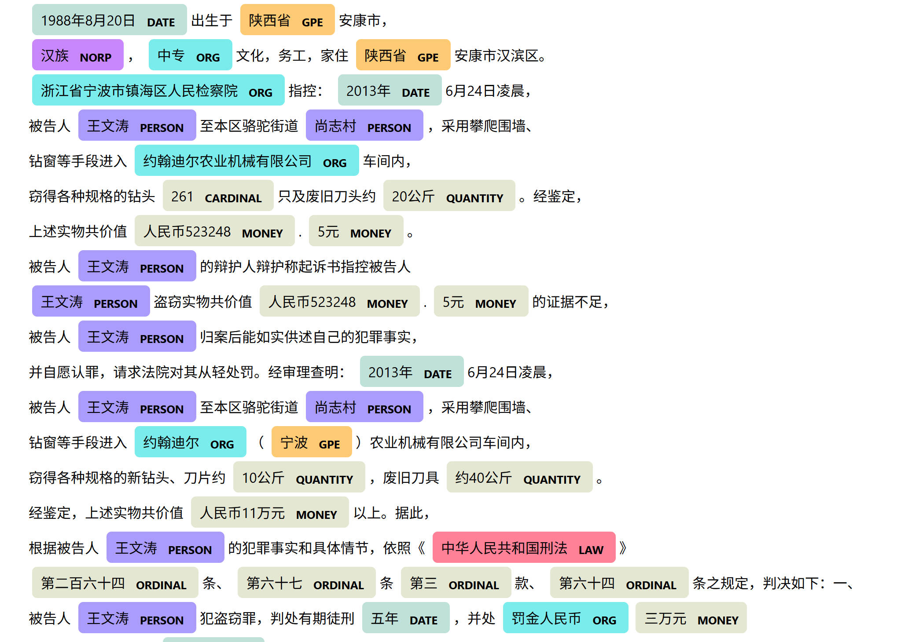
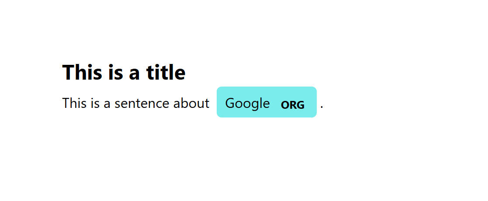
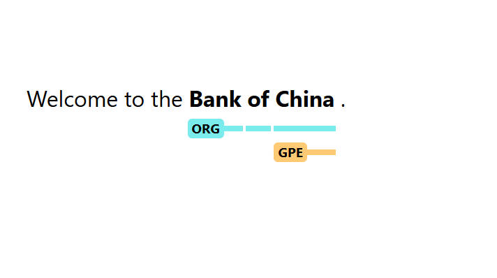

# 说明

---

关于NLP相关的另一个开源项目是：hanlp,这算是一个中文为主的项目

参考书籍：
1、Spacy自然语言处理从入门到进阶

2、https://course.spacy.io/zh/chapter1

https://chinesenlp.xyz/#/zh/docs/entity_tagging


---
在2013年之前，自然语言处理面临两个主要问题：
1、文本的表示方法
不同于语音的波形与图像的像素，文本缺乏一种直观的，可量化的表示方法。独热编码和词袋模型是两种早期的表达方式，但他们都存在明显的局限性。独热编码产生的向量非常稀疏，浪费空间，且无法表示词语之间的语义关系。词袋模型忽略了词语的顺序与依赖关系，无法准确捕捉文本的语义。例如词袋模型无法准确区别“李雷的儿子是谁？”和“谁的儿子是李雷”，尽管这两句话有显著的语义差异。
2、第二个主要问题是文本的建模方法
传统方法严重依赖人工特征工程，如TF-IDF用于表示词语的重要性，主题模型用于判断文档主题，以及利用语言学信息构建特征。

注：
TF-IDF是一种统计学方法，用于评估一个词语对一个文档集或者语料库中的一份文档的重要程度。基于假设：一个词语如果在某个文档中出现频率高，并且在其他文档中中出现的频率低，那么这个词语很可能就是这个文档的关键词，能够很好的代表这个文档的内容。TF-IDF的最终值是词频与逆文档频率的乘积。这个值越高，表示词语在当前文档中越重要，在整个文档集中较不常见。
TF-IDF被广泛用于信息检索与文本挖掘。例如，其在搜索引擎中用于评估查询和文档的相关性，在文本分析中被用于特征提取。尽管他是一个相对简单且有效的工具，但是它不考虑词语的上下文和语义关系，这在某些复杂的文本分析任务中可能是一个缺点。

主题模型也是一种统计模型，用于发现文档集合中隐藏的主题结构。他是一种无监督学习技术，可以在没有明确标注或分类的情况下，从文本数据中自动提取出主题。主题模型假设文档是由多个主题混合而成的，每个主题又由多个词语分布组成。
主题模型中最著名的算法是隐含狄利克雷，即LDA模型。LDA将文档视为一个概率生成过程，每个文档都会从一个主题分布中抽取主题，而每个主题又都是一个词语分布。这样，每个文档都可以表示为一个主题分布的混合，而每个主题则表示一个词语分布。

IEPY是一个用于信息提取的python工具包，在构建特征时，它会考虑多种因素

传统的自然语言处理应用经常使用传统方法解决实际问题，该方法的优点在于训练速度快，对标注数据的需求量较少，并对简单问题的处理效果也比较好。但是它的缺点时需要大量的人工特征工程和模型调参，在处理复杂任务的时候效果可能力不从心。

## word2vec

2013年，Tomas Mikolov发表了两篇具有里程碑式的论文。word2vec是一种高效的词嵌入学习工具，能够将词语转化为高维空间中的向量，这些向量可以捕捉词语的语义和上下文信息。
word2vec通过使用一个浅层的神经网络，在大规模语料库上进行训练，成功解决第一个问题。词向量的神秘之处在于尽管我们无法解释每一个维度的具体含义，但是，他们能够捕捉词语之间的语义关系。
word2vec和词向量的发明，使得自然语言处理可以摆脱繁琐的语言学特征工程，推动深度学习在自然语言处理的应用。这种表示学习的趋势，已经推广到知识图谱和推荐系统等多个领域之中。
word2vec的缺点，为每个词提供的向量表示是固定和静态的，但是同一个词在不同的上下文中应该具有不同的含义。


## ELMo

为解决上述问题，上下文词嵌入模型出现，不会对每个词语使用固定的词向量，而是在为词分配向量之前考虑整个句子的上下文，它使用在特定任务上训练的双向LSTM来创建这些词向量。LSTM是一种特殊的循环神经网络RNN,能够学习长程依赖关系。

## Transformer模型

Transformer模型于2017年发布，它在机器翻译任务上取得突破性的成果。与传统的LSTM不一样，它完全依赖于注意力机制来处理序列数据。注意机制是一种函数，它将查询与一组键对值映射到输出上。在这个机制中，输出值是输入值的加权和，其中每个值的权重是通过查询和对应键的函数计算得出的。

## GPT模型

在Transformer模型的基础上，开发了许多优秀的模型，比如GPT和BETA模型，GPT模型完全由Transformer模型的解码器层组成，它的目标是生成类似人类语言的文本

## BETA模型

BETA模型旨在提供更好的语言表达方法，以帮助上下游任务取得更好的结果。这些上下游任务包括句子对分类，单句分类，问答任务和单句标注任务。BETA模型的成果催生了一个庞大的模型家族。

## 自然语言处理的基础任务

1、由类别生成序列：文本生成，图像描述生成等
2、由序列生成类别：文本分类，情感分析，关系提取等
3、由序列同步生成序列：分词，词性标注，语义角色标注，实体识别等
4、由序列异步生成序列：机器翻译，自动摘要，拼音输入等

## SpaCy

```
pip install -U pip setuptools wheel
pip install -U spacy
python -m spacy download zh_core_web_sm
```

pip list：以表格形式列出包名和版本，适合快速查看。
pip freeze：以 包名==版本号 形式输出，常用于生成 requirements.txt 文件。

允许开发者自定义模型和管道以适应特定的自然语言要求
其核心概念如下：
1、nlp对象
进行文本处理和分析的中心组件，包含用于处理文本的管道，这些管道定义文本处理的各个阶段，如分词，词性标注，命名实体识别等。

```python
# import spacy

nlp = spacy.load("zh_core_web_sm")
doc = nlp("这是一个例子")

for token in doc:
    print(token.text, token.lemma_, token.pos_, token.tag_, token.dep_,
            token.shape_, token.is_alpha, token.is_stop)

```

这是  VERB VC cop xx True False
一个  NUM CD dep xx True True
例子  NOUN NN ROOT xx True False

2、doc对象
代表一个文本，包含文本的分析结果

3、Token对象
代表文本中的单个词符，如单词，标点符号等。

4、Span对象
代表文本中的一个连续片段，可以通过doc对象的切片来创建

5、Pipeline
一系列用于文本处理的组件，如分词，词性标注，命名实体识别等

6、Trainer
用于训练定制的模型，可以用来优化管道，以适应特定的NLP任务

7、Embeddings
词向量，用于表示词符在低维空间的位置

# 命名实体识别

命名实体可作为ents的属性Doc：

```python
import spacy

nlp = spacy.load("en_core_web_sm")
doc = nlp("Apple is looking at buying U.K. startup for $1 billion")

for ent in doc.ents:
    print(ent.text, ent.start_char, ent.end_char, ent.label_)
```

```pytnon
import spacy
from spacy import displacy

text = """被告人王文涛，男，
1988年8月20日出生于陕西省安康市，
汉族，中专文化，务工，家住陕西省安康市汉滨区。
浙江省宁波市镇海区人民检察院指控：2013年6月24日凌晨，
被告人王文涛至本区骆驼街道尚志村，采用攀爬围墙、
钻窗等手段进入约翰迪尔农业机械有限公司车间内，
窃得各种规格的钻头261只及废旧刀头约20公斤。经鉴定，
上述实物共价值人民币523248.5元。
被告人王文涛的辩护人辩护称起诉书指控被告人
王文涛盗窃实物共价值人民币523248.5元的证据不足，
被告人王文涛归案后能如实供述自己的犯罪事实，
并自愿认罪，请求法院对其从轻处罚。经审理查明：2013年6月24日凌晨，
被告人王文涛至本区骆驼街道尚志村，采用攀爬围墙、
钻窗等手段进入约翰迪尔（宁波）农业机械有限公司车间内，
窃得各种规格的新钻头、刀片约10公斤，废旧刀具约40公斤。
经鉴定，上述实物共价值人民币11万元以上。据此，
根据被告人王文涛的犯罪事实和具体情节，依照《中华人民共和国刑法》
第二百六十四条、第六十七条第三款、第六十四条之规定，判决如下：一、
被告人王文涛犯盗窃罪，判处有期徒刑五年，并处罚金人民币三万元
（限于本判决生效后一个月内向本院缴纳）；（刑期从判决执行之日起计算。"""

nlp = spacy.load("zh_core_web_sm")
doc = nlp(text)
displacy.serve(doc, style="ent", port=8080)
```



## 添加标题

```python
import spacy
from spacy import displacy
nlp = spacy.load("en_core_web_sm")
doc = nlp("This is a sentence about Google.")
doc.user_data["title"] = "This is a title"
displacy.serve(doc, style="ent",port=8080)
```



jupyter notebook的IPython似乎与spacy的某些地方冲突，上述代码无法很好的运行在jupyter中

## 可视化跨度

```python
import spacy
from spacy import displacy
from spacy.tokens import Span

text = "Welcome to the Bank of China."

nlp = spacy.load("en_core_web_sm")
doc = nlp(text)

doc.spans["sc"] = [
    Span(doc, 3, 6, "ORG"),
    Span(doc, 5, 6, "GPE"),
]

displacy.serve(doc, style="span",port=8080)
```



## 词符及其属性

我们要使用spaCy中的Doc和Token对象以及一些词汇属性来寻找文本中 表示百分比的部分。我们要寻找两个相邻的词符：一个人民币符号和一个数字。

检查词符的text属性是否是人民币符号”￥“。
获取文档中紧接着当前词符的词符。doc中下一个词符的索引是token.i + 1。
使用词符属性like_num来检查下一个doc中的词符是否构成一个数字。

```python
import spacy

nlp = spacy.blank("zh")

# 处理文本
doc = nlp(
    "在1990年，一份豆腐脑可能只要￥0.5。"
    "现在一份豆腐脑可能要￥5左右了。"
)

# 遍历doc中的词符
for token in doc:
    # 检测词符的文本是否是"￥"
    if token.text == "￥":
        # 获取文档中的下一个词符
        next_token = doc[token.i + 1]
        # 检测下一个词符是否组成一个数字
        if next_token.like_num:
            print("Price found:", next_token.text)
```