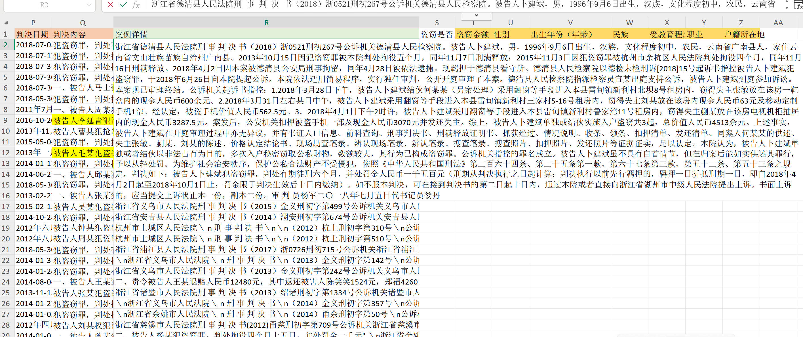
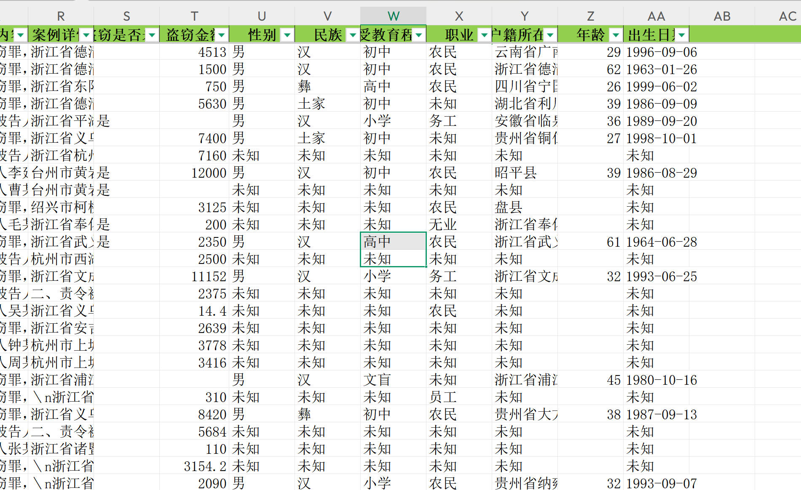

# python实战一
--- 
自然语言处理，命名实体识别，正则表达式，大模型api调用；
针对数据中的“案例详情”这一块里面有很多内容，希望可以用数据挖掘的办法把案例详情中有关被告人的盗窃金额、性别、年龄、民族、受教育程度、职业、户籍所在地，这些信息给筛选出来。

---
数据展示：


```
浙江省德清县人民法院刑 事 判 决 书（2018）浙0521刑初267号公诉机关德清县人民检察院。被告人卜建斌，男，1996年9月6日出生，汉族，文化程度初中，农民，云南省广南县人，家住云南省文山壮族苗族自治州广南县。2013年10月15日因犯盗窃罪被本院判处拘役五个月，同年11月7日刑满释放；2015年11月3日因犯盗窃罪被杭州市余杭区人民法院判处拘役四个月，同年11月16日刑满释放。2018年4月2日因本案被德清县公安局刑事拘留，同年4月28日被依法逮捕。现羁押于德清县看守所。德清县人民检察院以德检未检刑诉[2018]15号起诉书指控被告人卜建斌犯盗窃罪，于2018年6月26日向本院提起公诉。本院依法适用简易程序，实行独任审判，公开开庭审理了本案。德清县人民检察院指派检察员宣某出庭支持公诉，被告人卜建斌到庭参加诉讼。本案现已审理终结。公诉机关起诉书指控：1.2018年3月28日下午，被告人卜建斌结伙何某某（另案处理）采用翻窗等手段进入本县雷甸镇新利村北坝8号租房内，窃得失主张敏放在该房一鞋盒内的现金人民币600余元。2.2018年3月31日左右某日中午，被告人卜建斌采用翻窗等手段进入本县雷甸镇新利村三家村5-16号租房内，窃得失主刘某放在该房内现金人民币63元及移动定制手机1部。经认定，被盗手机价值人民币562.5元。3．2018年4月1日下午2时许，被告人卜建斌采用翻窗等手段进入本县雷甸镇新利村鲁家湾11号租房内，窃得失主蒯某放在该房电视机柜抽屉内的现金人民币3287.5元。案发后，公安机关扣押被盗手机一部及现金人民币3070元并发还失主。综上，被告人卜建斌单独或结伙实施入户盗窃共3起，总价值人民币4513余元。上述事实，被告人卜建斌在开庭审理过程中亦无异议，并有书证人口信息、前科查询、刑事判决书、刑满释放证明书、抓获经过、情况说明、收条、领条、扣押清单、发还清单、同案人何某某的供述、失主张敏、蒯某、刘某的陈述、价格认定结论书、现场勘查笔录、辨认现场笔录、辨认笔录、搜查笔录、搜查照片、扣押照片、发还照片等证据证实，足以认定。本院认为，被告人卜建斌单独或者结伙以非法占有为目的，多次入户秘密窃取公私财物，数额较大，其行为已构成盗窃罪。公诉机关指控的罪名成立。被告人卜建斌虽不具有自首情节，但在归案后能如实供述其罪行，予以从轻处罚。为维护社会治安秩序，保护公私合法财产不受侵犯，依照《中华人民共和国刑法》第二百六十四条、第二十五条第一款、第六十七条第三款、第五十二条、第五十三条之规定，判决如下：被告人卜建斌犯盗窃罪，判处有期徒刑六个月，并处罚金人民币一千五百元（刑期从判决执行之日起计算；判决执行以前先行羁押的，羁押一日折抵刑期一日，即自2018年4月2日起至2018年10月1日止；罚金限于判决生效后十日内缴纳）。如不服本判决，可在接到判决书的第二日起十日内，通过本院或者直接向浙江省湖州市中级人民法院提出上诉。书面上诉的，应当提交上诉状正本一份，副本二份。审 判 员杨军二〇一八年七月五日代书记员娄丹
```
---
## 正则表达式应用
批处理

```python
import pandas as pd
import re
from datetime import datetime
import numpy as np
from tqdm import tqdm  # 添加进度条库

# 预编译正则表达式以提高性能
CASH_PATTERN = re.compile(r'窃得.*?现金人民币(\d+(?:\.\d+)?)余?元')
ITEM_PATTERNS = [
    re.compile(r'价值人民币(\d+(?:\.\d+)?)元'),
    re.compile(r'价值(\d+(?:\.\d+)?)元'),
    re.compile(r'经.*?价格认证中心认定.*?价值人民币(\d+(?:\.\d+)?)元'),
    re.compile(r'该被窃.*?价值人民币(\d+(?:\.\d+)?)元')
]
TOTAL_PATTERNS = [
    re.compile(r'总价值人民币(\d+(?:\.\d+)?)余?元'),
    re.compile(r'涉案总价值共计人民币(\d+(?:\.\d+)?)元')
]
BIRTH_PATTERN = re.compile(r'(\d{4})年(\d{1,2})月(\d{1,2})日(?:出生|生)')
ETHNICITY_PATTERN = re.compile(r'，(\w+)族，')

# 定义职业列表
OCCUPATIONS = [
    '无业',
    '务工',
    '农民',
    '职工',
    '水泥工',
    '渔民',
    '非农户',
    '理发师',
    '无固定职业',
    '无职业',
    '无业',
    '个体户',
    '公司员工',
    '个体经营',
    '个体工商户',
    '网络销售',
    '公司主管',
    '车行销售',
    '居民',
    '铁匠',
    '经商',
    '工人',
    '驾驶员',
    '职员',
    '学生',
    '退休教师',
    '职业教育中心教师',
    '实习教师',
    '职业学院教师',
    '教育学院教师',
    '小学教师',
    '舞蹈教师',
    '医生',
    '司机',
    '厨师',
    '保安',
    '服务员',
    '销售员',
    '销售代表',
    '销售经理',
    '居民',
    '项目经理',
    '酒店副经理',
    '佯装印花厂老板',
    '兴和服饰老板',
    '足浴店老板',
    '退休',
    '待业',
    '退休工人',
    '公司职员',
    '温州博伟美容美发咨询有限公司拓展部经理',
    '员工',
    'KTV营销经理',
    '足浴店经理',
    '酒吧经理',
    '项目经理',
    '职业经理人',
    '娱乐会所总经理',
    '购物中心信息部经理',
    '打工' ,'会计']

# 户籍所在地匹配模式
RESIDENCE_PATTERNS = [
    # 标准格式：xx省xx市xx县人（必须包含"人"字）
    re.compile(r'([\u4e00-\u9fa5]+省[\u4e00-\u9fa5]+市?[\u4e00-\u9fa5]+县人)'),
    re.compile(r'([\u4e00-\u9fa5]+省[\u4e00-\u9fa5]+县人)'),
    re.compile(r'([\u4e00-\u9fa5]+省[\u4e00-\u9fa5]+区人)'),
    # 出生于xx省xx市xx县（必须包含"出生于"）
    re.compile(r'出生于([\u4e00-\u9fa5]+省[\u4e00-\u9fa5]+市?[\u4e00-\u9fa5]+县)'),
    re.compile(r'出生于([\u4e00-\u9fa5]+省[\u4e00-\u9fa5]+县)'),
    # 出生于xx省xx市（必须包含"出生于"）
    re.compile(r'出生于([\u4e00-\u9fa5]+省[\u4e00-\u9fa5]+市)'),
    # 出生地xx省xx市xx县（必须包含"出生地"）
    re.compile(r'出生地([\u4e00-\u9fa5]+省[\u4e00-\u9fa5]+市?[\u4e00-\u9fa5]+县)'),
    # 出生地xx省xx市（必须包含"出生地"）
    re.compile(r'出生地([\u4e00-\u9fa5]+省[\u4e00-\u9fa5]+市)'),
    # 家住xx省xx市xx县（必须包含"家住"）
    re.compile(r'家住([\u4e00-\u9fa5]+省[\u4e00-\u9fa5]+市?[\u4e00-\u9fa5]+县)'),
    # 户籍地xx省xx市xx县（必须包含"户籍地"）
    re.compile(r'户籍地([\u4e00-\u9fa5]+省[\u4e00-\u9fa5]+市?[\u4e00-\u9fa5]+县)'),
    # 户籍地xx省xx市xx区（必须包含"户籍地"）
    re.compile(r'户籍地([\u4e00-\u9fa5]+省[\u4e00-\u9fa5]+市?[\u4e00-\u9fa5]+区)'),
    # 户籍所在地xx市xx区（必须包含"户籍所在地"）
    re.compile(r'户籍所在地([\u4e00-\u9fa5]+市?[\u4e00-\u9fa5]+区)'),
    # 户籍所在地xx省xx市xx区（必须包含"户籍所在地"）
    re.compile(r'户籍所在地([\u4e00-\u9fa5]+省[\u4e00-\u9fa5]+市?[\u4e00-\u9fa5]+区)'),
    # 户籍所在地xx省xx市（必须包含"户籍所在地"）
    re.compile(r'户籍所在地([\u4e00-\u9fa5]+省[\u4e00-\u9fa5]+市)'),
    # 住xx县（必须包含"住"）
    re.compile(r'住([\u4e00-\u9fa5]+县)'),
    # 住xx市（必须包含"住"）
    re.compile(r'住([\u4e00-\u9fa5]+市)'),
    # 于xx省xx市（必须包含"于"）
    #re.compile(r'于([\u4e00-\u9fa5]+省[\u4e00-\u9fa5]+市)'),
    # 家住xx县（必须包含"家住"）
    re.compile(r'家住([\u4e00-\u9fa5]+县)'),
    # 自治区格式（必须包含"自治区"）
    re.compile(r'([\u4e00-\u9fa5]+壮族自治区[\u4e00-\u9fa5]+县)'),
# 户籍地xx省xx市xx县（必须包含"户籍地"）
    re.compile(r'户籍地([\u4e00-\u9fa5]+省[\u4e00-\u9fa5]+市?[\u4e00-\u9fa5]+县)'),
    # 户籍地xx省xx市xx区（必须包含"户籍地"）
    re.compile(r'户籍地([\u4e00-\u9fa5]+省[\u4e00-\u9fa5]+市?[\u4e00-\u9fa5]+区)'),
    # 户籍所在地xx市xx区（必须包含"户籍所在地"）
    re.compile(r'户籍地([\u4e00-\u9fa5]+区?[\u4e00-\u9fa5]+县)'),
       # 户籍所在地xx市xx区（必须包含"户籍所在地"）
    re.compile(r'户籍地([\u4e00-\u9fa5]+省?[\u4e00-\u9fa5]+县)'),
    re.compile(r'户籍地([\u4e00-\u9fa5]+县)'),
    re.compile(r'户籍地([\u4e00-\u9fa5]+市?[\u4e00-\u9fa5]+县)'),
    re.compile(r'户籍地([\u4e00-\u9fa5]+市?[\u4e00-\u9fa5]+区)'),
    re.compile(r'户籍地([\u4e00-\u9fa5]+市)'),
    re.compile(r'户籍地([\u4e00-\u9fa5]+省)'),
    re.compile(r'户籍地([\u4e00-\u9fa5]+县)'),
    # 户籍所在地xx省xx市xx区（必须包含"户籍所在地"）
    re.compile(r'户籍地([\u4e00-\u9fa5]+省[\u4e00-\u9fa5]+市?[\u4e00-\u9fa5]+区)'),
    # 户籍所在地xx省xx市（必须包含"户籍所在地"）
    re.compile(r'户籍地([\u4e00-\u9fa5]+省[\u4e00-\u9fa5]+市)'),
    # 自治州格式（必须包含"自治州"）
    re.compile(r'([\u4e00-\u9fa5]+省[\u4e00-\u9fa5]+自治州[\u4e00-\u9fa5]+县)')
]

# 需要排除的机构名称关键词
EXCLUDE_KEYWORDS = ['法院', '检察院', '人民法院','公安局', '派出所', '监狱', '看守所', '司法局', '监狱管理局']

# 受教育程度匹配模式
EDUCATION_PATTERNS = [
    # 标准格式：xx文化
    re.compile(r'([\u4e00-\u9fa5]+文化)'),
    # 文化程度xx
    re.compile(r'文化程度([\u4e00-\u9fa5]+)'),
    # 学历xx
    re.compile(r'学历([\u4e00-\u9fa5]+)'),
    # 文化程度为xx
    re.compile(r'文化程度为([\u4e00-\u9fa5]+)'),
    # 文化程度：xx
    re.compile(r'文化程度：([\u4e00-\u9fa5]+)'),
    # 文盲
    re.compile(r'(文盲)'),
    re.compile(r'([\u4e00-\u9fa5]+肄业)'),
]

def preprocess_text(text):
    """预处理文本，只保留与提取信息相关的部分"""
    if not isinstance(text, str):
        return ""
    
    # 1. 提取被告人基本信息部分（从"被告人"到第一个句号）
    basic_info = ""
    basic_info_match = re.search(r'被告人.*?。', text)
    if basic_info_match:
        basic_info = basic_info_match.group(0)
    
    # 2. 提取盗窃金额相关信息
    amount_info = ""
    # 提取所有包含金额的句子
    amount_sentences = re.findall(r'[^。]*?(?:窃得|价值人民币|价值|现金人民币|人名币|总价值|涉案总价值|人民币)[^。]*?。', text)
    amount_info = "".join(amount_sentences)
    
    # 3. 合并处理后的文本
    processed_text = basic_info + amount_info
    
    # 4. 清理文本
    # 删除包含罚金相关内容的句子
    processed_text = re.sub(r'[^。]*?(?:并处罚金|罚金|并处|单处罚金|附加刑|刑罚)[^。]*?。', '', processed_text)
    
    # 删除包含退赔、返还、赔偿等内容的句子
    processed_text = re.sub(r'[^。]*?(?:退赔|返还|赔偿|发还|退还|责令.*?退赔|责令.*?返还)[^。]*?。', '', processed_text)
    
    # 删除多余的空格和换行符
    processed_text = re.sub(r'\s+', ' ', processed_text)
    # 删除重复的标点符号
    processed_text = re.sub(r'[，。；：、]{2,}', '，', processed_text)
    
    return processed_text.strip()

def extract_amount(text):
    if not isinstance(text, str):
        return None

    # 优先提取"综上"后的总金额
    zongshang_patterns = [
        r'综上.*?价值人民币(\d+(?:，\d+)*(?:\.\d+)?)元',
        r'综上.*?价值(\d+(?:，\d+)*(?:\.\d+)?)元',
        r'综上.*?共计价值人民币(\d+(?:，\d+)*(?:\.\d+)?)元',
        r'综上.*?共计价值(\d+(?:，\d+)*(?:\.\d+)?)元',
        r'综上.*?涉案财物共计价值(\d+(?:，\d+)*(?:\.\d+)?)元',
        r'综上.*?涉案财物价值(\d+(?:，\d+)*(?:\.\d+)?)元',
        r'综上.*?窃得财物共计价值(\d+(?:，\d+)*(?:\.\d+)?)元',
        r'综上.*?窃得财物价值(\d+(?:，\d+)*(?:\.\d+)?)元',
        r'综上.*?合计价值人民币(\d+(?:，\d+)*(?:\.\d+)?)元',
        r'综上.*?合计价值(\d+(?:，\d+)*(?:\.\d+)?)元'
    ]
    
    for pattern in zongshang_patterns:
        match = re.search(pattern, text)
        if match:
            amount_str = match.group(1)
            # 处理逗号分隔的数字
            amount_str = amount_str.replace('，', '')
            return float(amount_str)

    # 优先提取总金额
    total_patterns = [
        r'总价值人民币(\d+(?:\.\d+)?)元',
        r'共计人民币(\d+(?:\.\d+)?)元',
        r'价值共计人民币(\d+(?:\.\d+)?)元',
        r'价值共人民币(\d+(?:\.\d+)?)元',
        r'总价值人民币(\d+(?:\.\d+)?)余元',
        r'共计人民币(\d+(?:\.\d+)?)余元',
        r'价值共计人民币(\d+(?:\.\d+)?)余元',
        r'价值共人民币(\d+(?:\.\d+)?)余元',
        r'损失价值共计人民币(\d+(?:\.\d+)?)元',
        r'损失价值共计人民币(\d+(?:\.\d+)?)余元',
        r'价值达人民币(\d+(?:\.\d+)?)余元',
        r'共计价值人民币(\d+(?:\.\d+)?)余元',
        r'共计价值(\d+(?:\.\d+)?)元',
        r'赃物价值人名币(\d+(?:\.\d+)?)元',
        r'共计价值人民币(\d+(?:\.\d+)?)元',
        r'窃得财物共计价值(\d+(?:\.\d+)?)余元',
        r'窃得财物共计价值(\d+(?:\.\d+)?)元',
        r'窃得财物共计(\d+(?:\.\d+)?)余元',
        r'窃得财物价值(\d+(?:\.\d+)?)余元',
        r'共盗窃作案.*?窃得财物共计价值人民币(\d+(?:\.\d+)?)元',
        r'共盗窃.*?窃得财物共计价值人民币(\d+(?:\.\d+)?)元',
        r'被窃财物价值共计(\d+(?:\.\d+)?)元',
        r'价值共计(\d+(?:\.\d+)?)余?元'
    ]
    
    for pattern in total_patterns:
        match = re.search(pattern, text)
        if match:
            return float(match.group(1))

    # 如果没有总金额，则提取所有金额并求和
    amount_contexts = []  # 存储(金额, 上下文)的元组
    patterns = [
        r'(现金人民币|劫得人民币|（价值人民币5500元）|内有人民币|盗得人民币|内有现金|涉案布匹价值|窃取现金人民币|窃得硬币|窃取现金|窃取现金|窃取人民币|窃得.*?人民币|人民币|价值人民币)(\d+(?:，\d+)*(?:\.\d+)?)余?元',
        #r'价值人民币(\d+(?:\.\d+)?)元',
        r'价值(\d+(?:，\d+)*(?:\.\d+)?)元'
    ]
    
    # print(f"开始提取金额，文本片段: {text[:100]}...")
    
    for i, pattern in enumerate(patterns):
        # print(f"测试模式 {i+1}: {pattern}")
        for m in re.finditer(pattern, text):
            if len(m.groups()) == 2:  # 第一个模式有两个组
                prefix = m.group(1)
                amount_str = m.group(2)
                # 处理逗号分隔的数字
                amount_str = amount_str.replace('，', '')
                amount = float(amount_str)
                # print(f"  匹配到: 前缀='{prefix}', 金额={amount}")
            else:  # 其他模式只有一个组
                amount_str = m.group(1)
                # 处理逗号分隔的数字
                amount_str = amount_str.replace('，', '')
                amount = float(amount_str)
                # print(f"  匹配到: 金额={amount}")
            
            # 获取金额前后20个字符作为上下文
            start, end = m.start(), m.end()
            context = text[max(0, start-20):min(len(text), end+20)]
            # print(f"  上下文: '{context}'")
            
            # 检查是否在"经鉴定"之后
            is_after_jingjianding = False
            # 查找金额位置之前的"经鉴定"
            before_text = text[:start]
            if '经鉴定' in before_text:
                # 找到最近的"经鉴定"位置
                jingjianding_pos = before_text.rfind('经鉴定')
                # 如果"经鉴定"在金额前100个字符内，认为是鉴定结果
                if start - jingjianding_pos <= 100:
                    is_after_jingjianding = True
                    # print(f"  在'经鉴定'之后，跳过排除检查")
            
            # 如果不在"经鉴定"之后，才进行排除检查
            if not is_after_jingjianding:
                # 如果上下文包含赔偿、退赔、返还、退还、发还等字样，则跳过
                if re.search(r'(赔偿|退赔|返还|退还|发还)', context):
                    # print(f"  跳过（包含排除关键词）")
                    continue
            
            amount_contexts.append((amount, context))
            # print(f"  添加到金额列表")

    # 调试信息：打印所有提取到的金额
    # print(f"提取到的所有金额: {[amount for amount, _ in amount_contexts]}")

    # 智能去重：相同金额且上下文相似度高的才去重
    unique_amounts = []
    for amount, context in amount_contexts:
        is_duplicate = False
        for existing_amount, existing_context in unique_amounts:
            # 如果金额相同且上下文相似度很高（可能是重复表述）
            similarity = _context_similarity(context, existing_context)
            if amount == existing_amount and similarity > 0.6:  # 降低相似度阈值
                is_duplicate = True
                # print(f"发现重复金额 {amount}，上下文相似度: {similarity:.3f}")
                # print(f"  现有上下文: '{existing_context}'")
                # print(f"  新上下文: '{context}'")
                break
        if not is_duplicate:
            unique_amounts.append((amount, context))
            # print(f"添加新金额: {amount}，上下文: '{context}'")

    # 调试信息：打印去重后的金额
    # print(f"去重后的金额: {[amount for amount, _ in unique_amounts]}")

    # 返回去重后的金额总和
    return sum(amount for amount, _ in unique_amounts) if unique_amounts else None

def _context_similarity(context1, context2):
    """计算两个上下文的相似度"""
    # 简单的相似度计算：共同字符数 / 较长字符串的长度
    common_chars = sum(1 for c in context1 if c in context2)
    max_len = max(len(context1), len(context2))
    return common_chars / max_len if max_len > 0 else 0

def extract_gender(text):
    if not isinstance(text, str):
        return '未知'
    # 优先匹配"性别男"或"性别女"
    match = re.search(r'性别([男女])', text)
    if match:
        return match.group(1)
    return '男' if '男' in text else '女' if '女' in text else '未知'

def extract_age(text):
    if not isinstance(text, str):
        return None
    
    # 更精确的出生日期匹配，要求包含"出生于"或"XXX生"
    # 只匹配被告人基本信息部分的出生日期
    basic_info_match = re.search(r'被告人.*?。', text)
    if basic_info_match:
        basic_info = basic_info_match.group(0)
        
        # 匹配包含"出生于"的日期
        birth_match = re.search(r'(\d{4})年(\d{1,2})月(\d{1,2})日出生于', basic_info)
        if birth_match:
            birth_year = int(birth_match.group(1))
            return datetime.now().year - birth_year
        
        # 匹配包含"XXX生"的日期
        birth_match2 = re.search(r'(\d{4})年(\d{1,2})月(\d{1,2})日生', basic_info)
        if birth_match2:
            birth_year = int(birth_match2.group(1))
            return datetime.now().year - birth_year
        
        # 匹配包含"XXX出生"的日期
        birth_match2 = re.search(r'(\d{4})年(\d{1,2})月(\d{1,2})日出生', basic_info)
        if birth_match2:
            birth_year = int(birth_match2.group(1))
            return datetime.now().year - birth_year
    
    return None

def extract_ethnicity(text):
    if not isinstance(text, str):
        return '未知'
    # 优先匹配"民族汉族"等
    match = re.search(r'民族([\u4e00-\u9fa5]+族)', text)
    if match:
        return match.group(1)
    # 更精确的民族匹配
    search_text = text[:200]
    ethnicity_match = re.search(r'，(\w+)族[，。]', search_text)
    if ethnicity_match:
        ethnicity = ethnicity_match.group(1)
        if any(keyword in ethnicity for keyword in ['省', '市', '县', '区', '镇', '村']):
            for i in range(len(ethnicity), 0, -1):
                potential_ethnicity = ethnicity[-i:]
                if len(potential_ethnicity) <= 3 and potential_ethnicity in ['汉', '满', '蒙', '回', '藏', '维', '壮', '苗', '彝', '土', '瑶', '侗', '白', '哈', '傣', '黎', '傈', '佤', '畲', '拉', '水', '东', '纳', '景', '柯', '达', '仫', '羌', '布', '毛', '仡', '阿', '普', '鄂', '怒', '京', '基', '德', '保', '裕', '乌', '门', '独', '鄂', '赫', '珞', '塔', '土', '撒', '锡', '俄', '鄂', '鄂', '鄂']:
                    return potential_ethnicity
        else:
            return ethnicity
    return '未知'

def extract_education(text):
    if not isinstance(text, str):
        return '未知'
    # 优先匹配"文化程度高中"、"文化程度为高中"、"文化程度：高中"、"学历高中"、"文化程度高中"、"文化程度为高中"、"文化程度：高中"
    match = re.search(r'文化程度[为：]?([\u4e00-\u9fa5]+)', text)
    if match:
        education = match.group(1)
        if any(keyword in education for keyword in ['省', '市', '县', '区', '镇', '村']):
            pass
        else:
            if '文盲' in education:
                return '文盲'
            elif '小学' in education:
                return '小学'
            elif '初中' in education:
                return '初中'
            elif '高中' in education:
                return '高中'
            elif '大学' in education:
                return '大学'
            else:
                return education
    # 匹配"学历高中"
    match2 = re.search(r'学历([\u4e00-\u9fa5]+)', text)
    if match2:
        education = match2.group(1)
        if any(keyword in education for keyword in ['省', '市', '县', '区', '镇', '村']):
            pass
        else:
            if '文盲' in education:
                return '文盲'
            elif '小学' in education:
                return '小学'
            elif '初中' in education:
                return '初中'
            elif '高中' in education:
                return '高中'
            elif '大学' in education:
                return '大学'
            else:
                return education
    # 匹配"文盲"
    if '文盲' in text:
        return '文盲'
    # 只在前200个字符中查找
    search_text = text[:200]
    for pattern in EDUCATION_PATTERNS:
        match = pattern.search(search_text)
        if match:
            education = match.group(1)
            if any(keyword in education for keyword in ['省', '市', '县', '区', '镇', '村']):
                continue
            if '文盲' in education:
                return '文盲'
            elif '小学' in education:
                return '小学'
            elif '初中' in education:
                return '初中'
            elif '高中' in education:
                return '高中'
            elif '大学' in education:
                return '大学'
            else:
                return education
    return '未知'

def extract_occupation(text):
    if not isinstance(text, str):
        return '未知'
    
    # 只在前100个字符中查找职业
    search_text = text[:100]
    
    # 在文本中查找预定义的职业
    for occupation in OCCUPATIONS:
        if occupation in search_text:
            return occupation
    
    return '未知'

def extract_residence(text):
    if not isinstance(text, str):
        return '未知'
    # 优先匹配"户籍地xxx"、"户籍所在地xxx"
    match = re.search(r'户籍[地所在地]*([\u4e00-\u9fa5]+省[\u4e00-\u9fa5]+县)', text)
    if match:
        residence = match.group(1)
        if not any(keyword in residence for keyword in EXCLUDE_KEYWORDS):
            return residence
    # 只在前300个字符中查找
    search_text = text[:300]
    for pattern in RESIDENCE_PATTERNS:
        match = pattern.search(search_text)
        if match:
            residence = match.group(1)
            if not any(keyword in residence for keyword in EXCLUDE_KEYWORDS):
                return residence
    return '未知'

def extract_birth_date(text):
    if not isinstance(text, str):
        return '未知'
    
    # 只在前200个字符中查找
    search_text = text[:200]
    
    match = BIRTH_PATTERN.search(search_text)
    if match:
        year, month, day = match.groups()
        # 标准化日期格式
        return f"{year}-{month.zfill(2)}-{day.zfill(2)}"
    
    return '未知'

def process_case_details(text):
    try:
        # 预处理文本
        processed_text = preprocess_text(text)
        
        return {
            '原始文本': text,  # 添加原始文本
            '预处理文本': processed_text,  # 添加预处理后的文本
            '盗窃金额': extract_amount(processed_text),
            '性别': extract_gender(processed_text),
            '年龄': extract_age(processed_text),
            '民族': extract_ethnicity(processed_text),
            '受教育程度': extract_education(processed_text),
            '职业': extract_occupation(processed_text),
            '户籍所在地': extract_residence(processed_text)
        }
    except Exception as e:
        print(f"处理文本时出错: {str(e)}")
        return {
            '原始文本': text,
            '预处理文本': '',
            '盗窃金额': None,
            '性别': '未知',
            '年龄': None,
            '民族': '未知',
            '受教育程度': '未知',
            '职业': '未知',
            '户籍所在地': '未知'
        }

def process_data_in_batches(input_file, output_file, batch_size=2000):
    # 读取所有数据
    df = pd.read_excel(input_file)
    # df = df.head(500)
    total_rows = len(df)
    
    # 计算需要处理的批次数
    num_batches = (total_rows + batch_size - 1) // batch_size
    
    # 创建一个空的DataFrame来存储所有结果
    all_results = pd.DataFrame()
    
    for batch_num in range(num_batches):
        print(f"Processing batch {batch_num + 1}/{num_batches}")
        
        # 计算当前批次的起始和结束索引
        start_idx = batch_num * batch_size
        end_idx = min((batch_num + 1) * batch_size, total_rows)
        
        # 获取当前批次的数据
        batch_df = df.iloc[start_idx:end_idx].copy()
        
        # 处理当前批次的数据
        batch_df['预处理文本'] = batch_df['案例详情'].apply(preprocess_text)
        batch_df['盗窃金额'] = batch_df['预处理文本'].apply(extract_amount)
        batch_df['性别'] = batch_df['预处理文本'].apply(extract_gender)
        batch_df['年龄'] = batch_df['预处理文本'].apply(extract_age)
        batch_df['出生日期'] = batch_df['预处理文本'].apply(extract_birth_date)
        batch_df['民族'] = batch_df['预处理文本'].apply(extract_ethnicity)
        batch_df['受教育程度'] = batch_df['预处理文本'].apply(extract_education)
        batch_df['职业'] = batch_df['预处理文本'].apply(extract_occupation)
        batch_df['户籍所在地'] = batch_df['预处理文本'].apply(extract_residence)
        
        # 将当前批次的结果添加到总结果中
        all_results = pd.concat([all_results, batch_df], ignore_index=True)
        
        # 每处理完一批就保存一次，以防程序中断
        all_results.to_excel(output_file, index=False)
        print(f"Saved progress to {output_file}")
    
    print("All batches processed successfully!")

if __name__ == "__main__":
    input_file = "zhejiang output.xlsx"  # 输入文件：包含原始案例数据的Excel文件
    output_file = "数据2.xlsx"  # 输出文件：处理后的结果文件
    process_data_in_batches(input_file, output_file) 
```

---
## 大模型api调用
```python
from openai import OpenAI
import pandas as pd
import json
import time

# 初始化Kimi(Moonshot)客户端
client = OpenAI(
    api_key="xxx", # 替换为你的API Key
    base_url="https://api.moonshot.cn/v1",
)

# 读取Excel数据
input_file = "测试.xlsx"
df = pd.read_excel(input_file)
# df = df.head(50)
if '案例详情' not in df.columns:
    raise ValueError('未找到"案例详情"列')

case_texts = df['案例详情'].astype(str).tolist()
batch_size = 5  # 减小批次大小以适应TPM限制

output_rows = []

for i in range(0, len(case_texts), batch_size):
    batch = case_texts[i:i+batch_size]
    print(f"处理批次 {i//batch_size + 1}/{(len(case_texts) + batch_size - 1)//batch_size}")
    
    user_content = f"""请从以下文本中提取盗窃总金额，需要汇总所有盗窃金额。

要求：
1. 如果文本中有多个盗窃金额，请将所有金额相加得到总金额
2. 只返回JSON格式的金额数组，每个案例一个总金额
3. 如果没有找到金额则返回null
4. 金额应该是数字，不要包含"人民币"、"元"等文字
5. 重要：只计算盗窃金额，不包括罚金、赔偿、退赔等处罚金额

示例格式：[391, null, 2500, 800, null]

文本内容：{json.dumps(batch, ensure_ascii=False)}"""
    
    try:
        completion = client.chat.completions.create(
            model = "moonshot-v1-8k",
            messages = [
                {"role": "system", "content": "你是一个专门提取盗窃金额的助手。只返回JSON格式的金额数组，不要其他解释。"},
                {"role": "user", "content": user_content}
            ],
            temperature = 0.1,  # 降低随机性
        )
        content = completion.choices[0].message.content.strip()
        
        try:
            # 尝试解析JSON
            batch_data = json.loads(content)
            if isinstance(batch_data, list):
                # 确保列表长度与批次大小一致
                while len(batch_data) < len(batch):
                    batch_data.append(None)
                batch_data = batch_data[:len(batch)]  # 截断多余的部分
                
                for amount in batch_data:
                    output_rows.append({"盗窃总金额": amount})
            else:
                # 如果不是列表，为每个批次项添加null
                for _ in batch:
                    output_rows.append({"盗窃总金额": None})
                    
        except json.JSONDecodeError as e:
            print(f"JSON解析失败: {e}")
            print(f"原始响应: {content}")
            # 为每个批次项添加null
            for _ in batch:
                output_rows.append({"盗窃总金额": None})
                
    except Exception as e:
        print(f"API调用失败: {e}")
        # 为每个批次项添加null
        for _ in batch:
            output_rows.append({"盗窃总金额": None})
    
    # 根据RPM限制调整延迟
    time.sleep(0.3)  # 200 RPM = 每3秒一个请求

# 保存为Excel
output_df = pd.DataFrame(output_rows)
output_df.to_excel("output1.xlsx", index=False)
print(f"处理完成，共处理 {len(output_rows)} 条记录")
print("已保存到output.xlsx")
```

---
## NER命名实体识别
### 第一版
```python
import pandas as pd
import spacy
from tqdm import tqdm

# 加载spaCy中文模型
nlp = spacy.load('zh_core_web_sm')

# 读取数据
input_file = 'extracted_case_info.xlsx'  # 路径根据实际情况调整
output_file = 'ner_extracted_case_info1.xlsx'
df = pd.read_excel(input_file).head(100)

# 检查案例详情列
if '预处理文本' not in df.columns:
    raise ValueError('未找到"预处理文本"列')

# 定义要提取的实体类型
entity_types = ['PERSON', 'GPE', 'ORG', 'DATE', 'MONEY', 'LOC', 'NORP']

# 新增列用于存储NER结果
for ent_type in entity_types:
    df[f'NER_{ent_type}'] = ''

def extract_ner_entities(text):
    if not isinstance(text, str):
        return {et: [] for et in entity_types}
    doc = nlp(text)
    result = {et: [] for et in entity_types}
    for ent in doc.ents:
        if ent.label_ in entity_types:
            result[ent.label_].append(ent.text)
    # 合并同类实体
    return {et: '；'.join(set(result[et])) for et in entity_types}

# 处理每条案例详情
for idx, row in tqdm(df.iterrows(), total=len(df)):
    ner_result = extract_ner_entities(row['预处理文本'])
    for ent_type in entity_types:
        df.at[idx, f'NER_{ent_type}'] = ner_result[ent_type]

# 保存结果
cols_to_save = ['预处理文本'] + [f'NER_{et}' for et in entity_types]
df[cols_to_save].to_excel(output_file, index=False)

print(f'NER抽取结果已保存到 {output_file}') 
```

### 第二版
```python
import pandas as pd
import spacy
from tqdm import tqdm
from extract_case_info import (
    preprocess_text, extract_amount, extract_gender, extract_age, extract_ethnicity,
    extract_education, extract_occupation, extract_residence, extract_birth_date
)

# 加载spaCy中文模型
nlp = spacy.load('zh_core_web_sm')

# 读取数据
input_file = 'extracted_case_info.xlsx'  # 路径根据实际情况调整
output_file = 'case_info_with_ner.xlsx'
df = pd.read_excel(input_file).head(100)

# 检查案例详情列
if '案例详情' not in df.columns:
    raise ValueError('未找到"案例详情"列')

# 定义要提取的实体类型
entity_types = ['PERSON', 'GPE', 'ORG', 'DATE', 'MONEY', 'LOC', 'NORP']

# 新增列用于存储NER结果
for ent_type in entity_types:
    df[f'NER_{ent_type}'] = ''

# 新增正则/规则抽取列
fields = ['盗窃金额', '性别', '年龄', '民族', '受教育程度', '职业', '户籍所在地', '出生日期']
for field in fields:
    if field not in df.columns:
        df[field] = ''

def extract_ner_entities(text):
    if not isinstance(text, str):
        return {et: [] for et in entity_types}
    doc = nlp(text)
    result = {et: [] for et in entity_types}
    for ent in doc.ents:
        if ent.label_ in entity_types:
            result[ent.label_].append(ent.text)
    # 合并同类实体
    return {et: '；'.join(set(result[et])) for et in entity_types}

# 处理每条案例详情
for idx, row in tqdm(df.iterrows(), total=len(df)):
    text = row['案例详情']
    # 正则/规则抽取
    processed_text = preprocess_text(text)
    df.at[idx, '盗窃金额'] = extract_amount(processed_text)
    df.at[idx, '性别'] = extract_gender(processed_text)
    df.at[idx, '年龄'] = extract_age(processed_text)
    df.at[idx, '民族'] = extract_ethnicity(processed_text)
    df.at[idx, '受教育程度'] = extract_education(processed_text)
    df.at[idx, '职业'] = extract_occupation(processed_text)
    df.at[idx, '户籍所在地'] = extract_residence(processed_text)
    df.at[idx, '出生日期'] = extract_birth_date(processed_text)
    # NER抽取
    ner_result = extract_ner_entities(text)
    for ent_type in entity_types:
        df.at[idx, f'NER_{ent_type}'] = ner_result[ent_type]

# 保存结果
cols_to_save = ['案例详情'] + fields + [f'NER_{et}' for et in entity_types]
df[cols_to_save].to_excel(output_file, index=False)

print(f'融合抽取结果已保存到 {output_file}') 
```

## 最终结果如下
